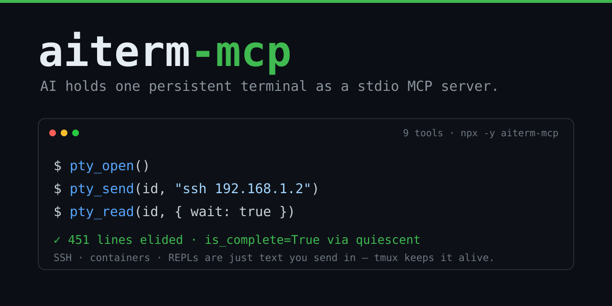
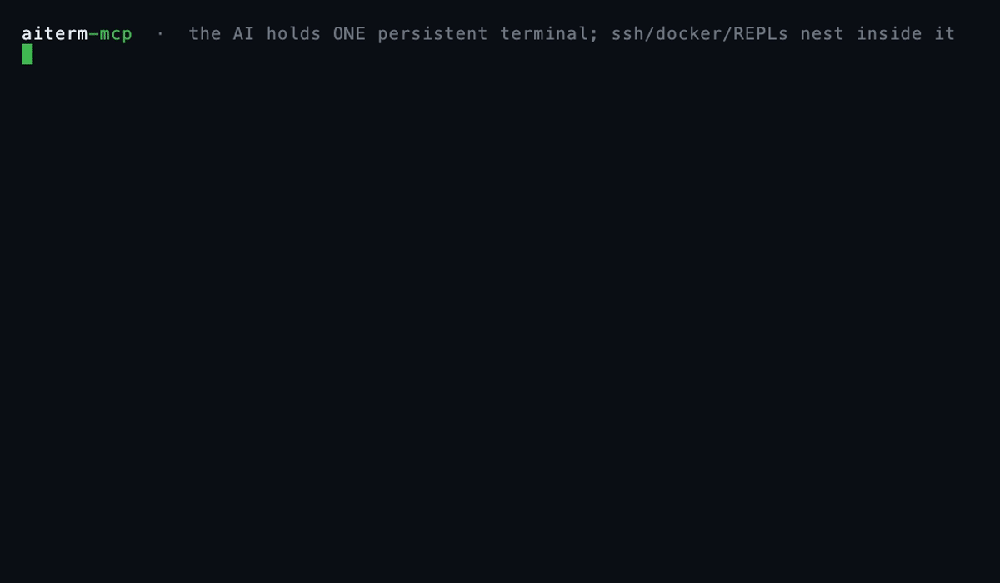
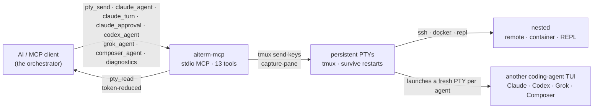

<p align="center">
  
</p>

# aiterm-mcp

[](https://github.com/kitepon-rgb/aiterm-mcp/actions/workflows/ci.yml)
[](https://www.npmjs.com/package/aiterm-mcp)
[](https://nodejs.org)
[](LICENSE)
[](https://packagephobia.com/result?p=aiterm-mcp)

> *(English: [README.md](README.md))*

> **あなたの AI に、ほかの AI を操らせる。** 任意の MCP クライアントから 1 回の呼び出しで、コーディングエージェント（Claude・Codex・Grok・Composer）を永続端末の中に起動し、操作用のセッションを手渡す。何をしているかをトークン削減して読み、次の指示を送る。
>
> **これは何か:** AI が握る 1 本の永続 MCP 端末——その中に他のコーディングエージェントも起動できる。`ssh`・`docker exec`・REPL・別エージェントの TUI は、すべてその 1 本の端末の中へ「送るだけのテキスト」として入れ子になる。仕組みはあえて素朴——MCP クライアントが相手エージェントの端末を 1 ターンずつ操作するだけ。隠れたプロトコルも・共有メモリも・自律的な交渉も無い。
>
> **人が tmux に張り付く必要はない。** aiterm は MCP 越しにプログラムから駆動されるので、「AI が別のエージェントを起動して操作する」のに端末の前に誰も座らなくていい——オーケストレーションのループ・CI ステップ・cron から動かせる。
>
> *MCP = Model Context Protocol — Claude Code のようなツールが AI に機能を差し込むためのオープン標準。*

**言葉でなく実測で:** このリポジトリ自身の 203 テストで、`pty_read` はコンテキストに載るトークンを生ログの **約 7.1 分の 1** に減らす。しかも pass/fail の判定は畳んでも残る。→ [組み込みシェルツールとの使い分け](#組み込みシェルツールとの使い分け)

13 ツール: 6 つの **PTY ツール**（`pty_open` / `pty_send` / `pty_read` / `pty_key` / `pty_close` / `pty_list`）で 1 本の永続端末を開き・操作し・読む。加えて 4 つの **エージェント起動ツール**（`claude_agent` / `codex_agent` / `grok_agent` / `composer_agent`）が別のコーディングエージェントの TUI を新しい端末の中に起動し、`claude_turn`がdurable caller向けの構造化issue／recoveryを、`claude_approval`がmanaged Claudeの相関済み承認UI中継を、`diagnostics`が安全なfactory readinessを返す。バックエンドは **tmux** なので、MCP サーバや AI クライアントが再起動してもセッションは生き残る。

**v0.18.1 を 2026-07-18 に公開**（0.18.0＋stale案内文言の修理1件）。実運用障害の還流による agent dispatch の hardening:
全 dispatch／launch receipt に **submit 座礁観測** `submit_residue` を追加
（送信 prompt が vendor TUI の composer に未 submit のまま残存していないかを有界に観測して報告する。
陽性証拠のみ・auto-retry なし）。agent への prompt paste は tmux **bracketed paste**（pane ごとの
negotiation）で包み、語中の文字化けと Enter 取り落としを抑制。初回 prompt 前の ready gate は
busy 表示中（esc to interrupt）の Codex/Claude を ready と数えない。
v0.16/0.17 以来、親エージェントは aiterm 上で一切ブロックしない:
agent session への send は常に非ブロック dispatch になり、完了待ちは `aiterm-wait` 一本
（exit code が receipt の outcome を映す: 0=done / 3=timeout=未完了 / 4=closed）、初回 prompt 付き
launch は structured receipt にコピペ可能な `wait_command` を含む。factory diagnostics と local
runtime-error store は canonical dotagents config の `collection.enabled: true` が明示された
場合だけ収集し、既定OFF、network送信は行いません。tag起点CIのnpm provenance（OIDC Trusted
Publishing）で公開し、GitHub Release が Official MCP Registry を再登録します。

**状態:** 開発継続中 · この分野では新参で、別の形に賭けている（[既存手段との比較](#既存手段との比較)参照）· 動作対象は Linux · WSL2 · macOS · Windows ネイティブ（core PTY ツール。`agent_done` は現時点では POSIX/WSL/macOS のみ）· MIT · [変更履歴](CHANGELOG.md)。

## なぜ今

2026 のエージェントツールの多くはオーケストレーションへ寄っていっている——先導するモデルが機械的なリファクタを Codex に委ね、一括編集を Composer に走らせながら自分は diff をレビューし、1 つのタスクを複数エージェントに分散して自分のコンテキスト窓を守る。そうしたエージェントはどれも既に端末の中に住んでいる。aiterm はその端末を一級の・MCP ネイティブなツールにする——だから指揮するモデルは、**人がペインを配線しなくても他のエージェントを起動して操れる。**

## 2 つの使い方

### 1. SSH・コンテナ・REPL を 1 本の永続端末で操作する — 土台

これが土台で、tmux だけで動く——他の CLI は要らない。`pty_open` がローカル端末を 1 個握り、`ssh host`・`docker exec -it x bash`・REPL は、その中へ `pty_send` で打ち込む「ただのテキスト」——**一度だけ**。以降のコマンドは同じ認証済みセッションを通る。セッション種別をツールで区別しない。

```
pty_open()                         → ローカル端末を 1 個握る
pty_send(id, "ssh 192.168.1.2")    → その端末の中で一度だけ認証して入る
pty_send(id, "uname -a")           → 以降のコマンドは同じセッションを通る
pty_read(id, { wait: true })       → 削減済みの出力を読む（完了検出つき）
```

<sub>**起源.** これのために aiterm を作った。自宅サーバを Claude Code からコマンド 1 個ずつ叩くと、SSH コマンドは毎回「接続→認証→切断」になる——鍵のパスフレーズもワンタイムコードも毎回打ち直し、短命セッションが増殖し、やがて自分の防御（`fail2ban`・`MaxStartups`/`MaxSessions`・アカウントロック）に締め出される——攻撃者を止める仕組みに自分が止められる。1 本の認証済みセッションを握れば 3 つとも一度に消える。この痛みがこの永続端末が存在する理由で、その中に丸ごと別のエージェントを起動するのは、そこから育った姿だ。</sub>

### 2. その端末の中に他のコーディングエージェントを起動する — オーケストレーションの旗艦

同じ primitive が別エージェントの TUI を宿す。4 つの起動ツールが、Claude/Codex/Grok/Composer の対話 TUI を新しい永続端末の中に起動し、`session_id` を返す。既存の人間向けtextに加えて`aiterm.agent-launch-result.v1` structured receiptも返すため、durable callerは表示文字列を解析せずsession handleを取得できる。以後は同じ `pty_read` / `pty_send` で継続操作する。**起動は常に managed**（aiterm 所有の Stop hook 付き）で、agent session への `pty_send` は非ブロックの **dispatch** になり `event_cursor` 入り receipt を即返す。完了通知は `aiterm-wait --session <id> --cursor <event_cursor>` をホストのバックグラウンドタスクとして実行し、exit 時に receipt の `outcome` で判定する（exit 0=done / 3=timeout=未完了・既定600秒 / 4=closed。親はブロックもポーリングもしない）。起動時 `prompt` を渡した launch は structured receipt にコピペ可能な `wait_command` と `event_cursor`、そして `submit_residue` 観測を含む（true=prompt が composer に未 submit で残存している疑い＝案内に従い画面確認から復旧 / false=残存観測せず・成立の保証ではない / null=対象外）。dispatch receipt にも同じ観測が付く。durable machine callerは`claude_turn({ action:"issue"|"recover", session_id, operation_id, ... })`を使い、人間向けerror文字列を解析せず`accepted`／`pending`／`completed`／`unknown`を判定できる。recoveryは再送せず、検証済み完了だけがexact `raw_output`を持つ。通常の`pty_send`／`pty_read`は対話callerと人間向けに維持する。`C-c`後もmarkerを保持し、Stopが来なければsessionをcloseする。`claude_agent` と `codex_agent` の初回 `prompt` は ready gate 経由で送信して待たずに返る（Grok/Composer は argv 渡し）。手動でキー操作したい場合は `pty_open` で素の端末を開き vendor CLI を自分で起動する。

```text
codex_agent({ session_name: "codex1", cwd: "/repo",
              prompt: "port test/legacy.py to vitest" })
                                    → { session_id: "codex1", … }   # Codex が永続端末で稼働開始
pty_read("codex1", { screen: true })   → 何をしているか読む（トークン削減）
pty_send("codex1", "also fix the imports it broke")   # 非ブロックdispatch＝event_cursor入りreceipt
$ aiterm-wait --session codex1 --cursor <event_cursor>   # exit 0=done / 3=timeout(未完了) / 4=closed。回収は pty_read(agent_transcript:true)
                                    → 操舵し、Codex の次の入力境界で返る
```

モデルごとに 1 ツール＝ツール名を見ればどのモデルか分かる:

| ツール | 起動するもの | 主な引数 |
| --- | --- | --- |
| `claude_agent` | Claude Code CLI（Anthropic） | `prompt?`, `model?`, `reasoning_effort?`（`low`/`medium`/`high`/`xhigh`/`max`）, `cwd?`, `session_name?` |
| `codex_agent` | Codex CLI（OpenAI・端末設定／CLI既定、`model?`で上書き） | `prompt?`, `model?`, `reasoning_effort?`（`low`/`medium`/`high`/`xhigh`/`max`/`ultra`）, `cwd?`, `session_name?` |
| `grok_agent` | Grok Build（xAI、既定`grok-4.5`、`model?`で上書き） | `prompt?`, `model?`, `reasoning_effort?`は非対応（指定時は明示エラー）, `cwd?`, `session_name?` |
| `composer_agent` | Grok Build（xAI、既定`grok-composer-2.5-fast`、`model?`で上書き） | `prompt?`, `model?`, `reasoning_effort?`は非対応（指定時は明示エラー）, `cwd?`, `session_name?` |

各ベンダーの CLI が導入・認証済みであること（`claude_agent` は `claude`、`codex_agent` は `codex`、Grok 系は `grok`）。バイナリは `CLAUDE_BIN` / `CODEX_BIN` / `GROK_BIN`、各既定path、`PATH` の順で解決する。CLI不在・不正なmodel/effort・実在しない`cwd`はsession作成前に失敗し、残骸を残さない。Claudeは通常settingsを継承しないlaunch専用settingsとStop hookを使い、本文なしeventとowner-only bounded resultを分離する。`pty_read({ agent_transcript:true })`はdigestとbyte数を検証したresultだけを返し、Claude private transcriptを読まない。後着resultは同じsessionからprompt再送なしで回収できる。managed Claudeのactive turn中はC-c以外の`pty_key`と素送信を拒否する。Claudeが`Do you want to proceed?`を表示したら、`claude_approval(action:"inspect", ...)`で画面digestを取得し、表示内容を判断してから、そのdigestと`approve_once`または`deny`を`respond`へ渡す。同じoperation・同じ画面が維持されている時だけ入力し、任意文字列や恒久許可選択肢は中継しない。中断は`C-c`、解除は`pty_close`。

エージェント間の隠れたプロトコルは無い。起動したClaude/Codex/Grok/Composerは利用者がattachできるもう1本の永続sessionであり、MCPクライアントが通常のPTY操作で駆動する。

## デモ

<p align="center">
  
</p>

リポジトリ内で今このツールに実際に通した本物の採取——数値も省略マーカーも各 `is_complete` の判定も、すべてツール自身の出力で、モックではない。角括弧のメタ行は `pty_read` が実際に付けるもの（この日本語 README ではメタ行を実出力のまま載せている。英語版は可読性のため訳出している）。

長い出力を head+tail に畳む——中間を省いているのは私でなく reducer（166 → 56 トークン）:

```text
→ pty_send("demo", "seq 1 150")
→ pty_read("demo", { wait: true })
← 1
  2
  3
  ⋮  （head は 29 行目まで続く——この README では省略表示）
  … 〈102 行省略。全文は full=true、範囲は line_range="A:B"〉 …    ← ツール自身のマーカー
  ⋮  （tail は 132 行目から再開——この README では省略表示）
  149
  150
  [aiterm demo: 51 行 / ~56 tok (raw 152 行 / ~166 tok); 102 行 hidden] [is_complete=True via quiescent]
```

`grep` を、コマンド別 reducer で「件数ヘッダ＋ヒット行だけ」に畳む:

```text
→ pty_send("demo", "grep -rn capture-pane src/ test/")
→ pty_read("demo", { wait: true, rtk: true })
← 2 matches in 1 files:

  src/core.ts:159:// maxBuffer は既定 1MiB。capture-pane（大きなスクロールバック）… （行はここで truncate）
  src/core.ts:335:const args = ["capture-pane", "-p", "-J", "-t", name];
  [aiterm demo: rtk:grep 適用 / ~46 tok (raw ~53 tok)] [is_complete=True via quiescent]
```

ネストは「中へ送るただのテキスト」——同じ PTY の*中で* Python REPL に入る（`ssh host`・`docker exec -it … bash`・起動したコーディングエージェントの TUI も、まったく同じ要領でネストする）:

```text
→ pty_send("demo", "python3")
→ pty_read("demo", { until: ">>>" })              # 入れ子側のプロンプト = 「内側シェルが応答できる」
→ pty_send("demo", "print(sum(range(1_000_000)))")
→ pty_read("demo", { wait: true, until: ">>>" })
← 499999500000                                     [is_complete=True via until]
```

上の採取で私が触ったのは 2 本の `⋮` 行（長い head/tail を README 用に省略）と長すぎる grep 行 1 本の truncate だけ——`〈…〉` マーカー・トークン数・各 `is_complete` はツールが出した通り。（`until` は末尾スペース無しの `">>>"` を使う——採取されるプロンプトは末尾が削られるので `">>> "` だと外れて `timeout` に落ちる。）ネスト中は `until`（内側プロンプト）か `mark: true` を渡すこと——そこでは quiescence が原理的に効かないため（[完了検出](#完了検出5-層) / [既知の制約](#既知の制約バグではなく仕様)）。同じ tmux ソケットに人が `attach` すれば、これらをライブで覗ける（[人が覗く](#人が覗く)）。

## クイックスタート（約60秒）

Claude Code なら 1 コマンドで登録——clone もビルドも不要、`npx` が毎回取得して起動する:

```bash
claude mcp add --scope user --transport stdio aiterm -- npx -y aiterm-mcp
```

Claude Code を再起動して、接続を確認:

```bash
/mcp        # aiterm が connected・13 ツール公開、と出る
```

最初のセッション——4 回の呼び出しで、1 個の永続端末:

```text
pty_open()                          → { session_id: "t1", attach: "tmux -S … attach -t t1" }
pty_send("t1", "echo hello")        → PTY にコマンドを送る
pty_read("t1", { wait: true })      → "hello"   （トークン削減・完了検出つき）
pty_close("t1")                     → 端末を解放
```

`pty_close` は冪等で、`closed` / `already_closed` のstructured receiptを返す。
MCP応答を失ったdurable callerも同じ`session_id`への再試行だけでclose結果を確定できる。

これだけ。`t1` の端末は本物で永続——`ssh`・`docker exec`・REPL・起動したエージェントの TUI は、そこに住む「もの」に過ぎない。代わりにワーカーのエージェントを起動するのも 1 コール: `codex_agent()` が返す `session_id` を、同じ `pty_read` / `pty_send` で操作する。

**グローバル導入や別クライアントが良い場合は:**

```bash
# グローバル導入してコマンド名で登録
npm i -g aiterm-mcp
claude mcp add --scope user --transport stdio aiterm -- aiterm-mcp
```

`~/.claude.json` に登録され、初回に承認プロンプトが出る。**他の MCP クライアント**（Cursor / Cline / Claude Desktop …）でも同様に動くはず——stdio で `npx -y aiterm-mcp`（または `aiterm-mcp`）を起動するだけ。**Node ≥ 18** と **tmux** が必要——[要件](#要件)参照。

## ヘッドレス: 端末に人が居ない

MCP クライアントが aiterm を stdio 越しにプログラムから駆動するので、上のすべては **tmux に誰も座らないまま**動く。あなたの Claude Code セッションは、`codex_agent()` でタスクを起こし、`pty_read` で結果を読み、それを使って動ける——無人で。これは、人が操作する端末が向かない場所にこそ aiterm が合うということ:

- **複数エージェントのオーケストレーション** — 統括役がサブタスクを Codex / Grok / Composer に渡し、各々を専用の永続セッションに置き、全部を読み戻す。
- **CI** — ジョブのステップがエージェントを起こし、操作し、片付けられる。
- **cron** — スケジュール実行がエージェントを起動して出力を回収できる。

端末は本物で共有されているので、人が*割り込むことも*できる（[人が覗く](#人が覗く)）——が、人を必要とはしない。

## 仕組み



primitive は「PTY を 1 個握る」ことだけ。それ以外——SSH・コンテナ・REPL・起動したエージェント TUI——は、永続端末の中で動く「対話的な何か」に過ぎず、同じ `pty_send` / `pty_read` で操作する。各起動ツールは自分専用の新しい PTY を開く。PTY は tmux 上にあるので、MCP サーバや AI クライアントが再起動してもセッションは生き残る。

## 組み込みシェルツールとの使い分け

MCP クライアントには最初からシェルツールが付いている。軽い用事はそれで足りるし、aiterm が活きる場面は別にある。その線引きを、同じコマンドで両方に通して確かめた。トークンの数え方は両側で揃えてある（文字数 ÷ 4、aiterm が実際に使う見積り式）ので、比較はフェアだ。

ちょっとしたコマンドなら、組み込みツールのほうが速い。`git log --oneline -5` を 1 回で返すのに対して、aiterm は `pty_send` と `pty_read` で 2 回のやり取りが要る。この 1 往復ぶんの差が、軽いコマンドではそのまま損になる（~7 秒 vs ~13 秒）。

出力が長いとき、あるいは状態を次の呼び出しへ持ち越したいときに、この 2 往復目が元を取る。

| コマンド | 組み込みシェル | aiterm | 判定 |
| --- | --- | --- | --- |
| `git log --oneline -5` | 1 回・~7 秒 | 2 回・~13 秒 | **シェル**（往復が少ない） |
| `npm test`（203 テスト） | ~4,292 tok | ~607 tok | **aiterm**（判定は残る） |
| `find node_modules -type f` | ~500 tok¹ | ~456 tok | 互角。aiterm は先頭も末尾も残す |
| `grep -rn "session" src/` | ~2,989 tok | ~1,096 tok | **aiterm**（長い行は切られる²） |

例えばこのリポジトリの 203 テストを走らせてみる。組み込みツールはログ 223 行をまるごと——~4,292 トークン——コンテキストに流し込む。aiterm は同じ出力を head+tail に畳んで ~607 トークンまで縮める。

```text
[aiterm demo: 51 行 / ~607 tok (raw 223 行 / ~4292 tok); 172 行 hidden] [is_complete=True via mark]
```

モデルに読ませるトークンは約 **7.1 分の 1** に減る。それでも判定は残る。畳んだ後の tail に `ℹ tests 203 / ℹ pass 203 / ℹ fail 0` がちゃんと載っている。削れたのは繰り返しのノイズで、ログを開いた目的の行は生きている。実行時間はほぼ同じなので、これだけ長いコマンドになると 2 往復の差は誤差に埋もれる。

aiterm はセッションの状態も持ち越せる。組み込みツールは呼び出しごとにまっさらなシェルを立てるので、cwd は毎回プロジェクト直下に戻り、環境変数も引き継がれない。試しに `cd /tmp && export BENCH_VAR=hello123` を送って、別の呼び出しで読み返してみる。

```text
組み込みシェル  →  var=                   # 空。env は消え、cwd はプロジェクト直下に戻る
aiterm          →  cwd=/tmp var=hello123  # 1 本の tmux セッションが両方を保つ
```

cd でディレクトリを移り、環境変数を立て、ビルドを走らせる。ssh で一度ログインして、その接続のまま 10 個コマンドを打つ。REPL や起動したエージェントの TUI を 1 ターンずつ操作する。こういう流れは、1 本の tmux セッションが状態を握っていて初めて成り立つ。端末に何かを覚えておいてほしいときは、aiterm を使う。

<sub>¹ いまのハーネスは ~192 KB の出力をいったんファイルに逃がして、先頭 ~2 KB だけを見せる。そのためトークン数はほぼ並ぶ。aiterm は行数を正確に返すうえ、あとから `line_range="A:B"` で好きな範囲（先頭でも末尾でも）を取り出せる。² `rtk` の grep 縮約は長い行（~80 字）を切り詰めて、あふれを `[+N more]` にまとめる。ざっと眺めるには向くが、全行をそのまま読みたいときは組み込みツールを使う。</sub>

## 既存手段との比較

aiterm は 2 つの系譜の交点にいる——端末を操作する MCP サーバと、より新しい「エージェント同士が共有端末越しに会話する」という発想（[aiterm の立ち位置](#aiterm-の立ち位置)参照）。各軸の並びはこうなる——相手が強い所も含めて、正直に。

|  | **aiterm-mcp** | 1 コマンド毎の往復<br/>(例: `mcp-server-commands`) | terminal / SSH / tmux MCP<br/>(例: `iterm-mcp`, `ssh-mcp`, `tmux-mcp`) | 共有 tmux でエージェント同士<br/>(例: `smux`) |
| --- | --- | --- | --- | --- |
| 永続セッション | ✅ tmux・再起動を跨ぐ | ❌ 毎回新シェル | ⚠️ まちまち | ✅ tmux |
| SSH / コンテナ / REPL | `pty_send` 1 回でネスト | 毎コマンド接続し直し | ⚠️ ツールが分かれがち | ✅ tmux（人が操作） |
| 1 コールで別エージェント起動 | ✅ `codex_agent` / `grok_agent` / `composer_agent` | ❌ | ❌ | ⚠️ 人が動かす tmux に CLI + skills で参加 |
| ヘッドレス（人が tmux に居ない） | ✅ MCP 駆動・プログラム的 | ✅ | ⚠️ まちまち | ❌ 人が tmux に居る前提 |
| MCP ネイティブ（任意の MCP クライアント） | ✅ `claude mcp add` 1 行 | ✅ | ✅（MCP なので） | ❌ tmux 設定 + CLI + Agent Skills |
| トークン削減読取 | ✅ コマンド別 reducer | ❌ 生出力 | ⚠️ ほぼ無し | ❌ 生 tmux |
| 完了検出 | 5 層: 終了 / `mark` / `until` / 静止 / timeout | 無し（毎回ブロック） | ⚠️ プロンプト一致・脆い | ❌ エージェントがペインを読む |
| 破壊コマンド遮断 | ✅ tripwire（`force` で越える） | ❌ | ⚠️ まちまち | ❌ |
| 人が同時操作 | ✅ 共有 tmux ソケット（`attach`） | ❌ | ⚠️ まちまち | ✅（設計の芯） |

## aiterm の立ち位置

「エージェント同士が共有端末越しに会話する」は、それ自体が 1 つのカテゴリになりつつある——そして本当に良い発想だ。端末はどのコーディングエージェントも既に話せる普遍インタフェースで、専用のエージェント間プロトコルは要らない——シェル*そのもの*が共有面になる。`smux`（by @shawn_pana）はこの発想を、人が用意する 1 コマンドの共有 tmux 環境として広め、エージェントは `tmux-bridge` CLI と Agent Skills でそこに参加する。人が輪の中にいる共有ペインのワークフローに強く、実際に支持を集めている。

aiterm は同じ核心の洞察——端末を出会いの場にする——を取り、あえて 3 つの違う選択をした:

1. **ヘッドレスが前提。** aiterm は MCP 越しにプログラムから駆動されるので、「AI が別のエージェントを起動して操作する」のに *tmux に人が座らなくていい*——オーケストレーションのループ・CI ステップ・cron から動く。共有 tmux 系は人がキーボードの前に居ることを主軸にしていて（ドキュメントも対話的なペイン操作が中心）、無人運用は本来の姿ではない——aiterm はそれが本来の姿だ。
2. **MCP ネイティブ＝採用させるワークフローではない。** aiterm は stdio MCP サーバ: `claude mcp add` 1 行で、stdio を話す任意の MCP クライアントに構造化ツールとして刺さる（実機確認は Claude Code。Cursor / Cline / Claude Desktop も同じプロトコルなので同様に動くはず）。tmux 設定の採用も・ペイン操作の習得も・skills の導入も求めない——クライアントは既にツール呼び出しの仕方を知っている。
3. **エージェント起動が 1 ツールコール＝オーケストレーションの primitive。** `codex_agent()` が Codex を永続端末に起こし、すぐ操作できるセッションを返す。ペインを手で並べたり貼り付けたりしない——起動も・操舵も・読取も、指揮するモデルが自分で打てるツールコールだ。

その上に、生の tmux ブリッジには無い製品化レイヤが乗る: **トークン削減読取**・**5 層の完了検出**・**破壊コマンドの tripwire**。これらは人が tmux に居るモデルを否定しない——人がどこに立つかについての、別の・補完的な賭けだ。

## ツール

| ツール | 役割 | 主な引数 |
| --- | --- | --- |
| `pty_open` | 端末を 1 個握り `session_id` を返す | `name?`, `shell="bash"` |
| `pty_send` | テキストを送る。agent sessionでは非ブロックdispatchとして`event_cursor`を返す | `session_id`, `text`, `enter=true`, `mark`, `force`, `rtk`, `raw` |
| `pty_read` | 出力を削減して読む（既定は増分） | `session_id`, `wait`, `until`, `until_regex`, `timeout`, `screen`, `full`, `lines`, `line_range`, `raw`, `rtk`, `agent_transcript`, `operation_id` |
| `pty_key` | 制御キーを送る | `session_id`, `key`（`C-c`/`Enter`/`Up`…） |
| `pty_close` | 冪等に閉じ、`closed` / `already_closed`を返す | `session_id` |
| `pty_list` | セッション一覧 | （なし） |
| `claude_turn` | 相関済みmanaged Claude operationをdispatch（issue）または回収（recover） | `action`, `session_id`, `operation_id`, `text?` |
| `claude_approval` | 現在表示中の相関済みmanaged Claude承認UIを検査または応答 | `action`, `session_id`, `operation_id?`, `approval_choice?`, `observed_prompt_digest?` |
| `diagnostics` | 機械可読 JSON による read-only factory readiness | （なし） |

`diagnostics` は PTY やエージェントを起動しない。パッケージ版、MCP 呼出 readiness、read-only な PTY 一覧要約、bounded runtime-error-store status、任意 vendor launcher の可用性だけを返す。path・環境値・認証情報・コマンド本文・PTY 出力・raw log は意図的に返さない。通常未設定の任意依存は `not_applicable`、安全に確定できない状態は `unverified` と表す。

### ローカル runtime error snapshot

`aiterm-runtime-errors snapshot` は dotagents factory adapter 向けに、製品所有のローカル snapshot を機械可読 JSON で返す。canonical dotagents factory-reporter config が schema-exact、host profile が実行 OS と一致し、`collection.enabled` が JSON boolean `true` の時だけ収集する。reporting field は schema 検証するが endpoint/credential file へ接続・読取せず network I/O も行わない。観測 API は core owner layer の固定3 code（PTY dependency・persistence・任意 vendor launcher）だけを受け、保存するのも固定 template と aggregate metadata（SHA-256 fingerprint、count、first/last、status、monotonic sequence）だけ。exception、stderr/stdout、stack、prompt、PTY/transcript/event body、path、任意 context は受け付けない。保存済み JSON も top/record exact・固定定義一致・fingerprint 再計算を通し、明示 DTO だけを返す。

consumer は `aiterm-runtime-errors snapshot` を読み、durable ingestion 後に `aiterm-runtime-errors ack --cursor N` を呼ぶ。運用上の明示操作は `resolve|reopen --fingerprint SHA256`。MCP からの収集・diagnostic read は timeout 付き child process に隔離し、FIFOや停止 filesystem が端末本体を止めない。store mutation は期限付き bakery ticket queue で直列化する。各waiterは PID＋process start identity＋owner token を持つ再利用されない固有ticketを所有するため、死んだownerだけを固有名で除去でき、固定path回収のABAを作らない。POSIX state は `$XDG_STATE_HOME/aiterm-mcp/`（既定 `~/.local/state/aiterm-mcp/`）へ atomic replacement で置き、every read で owner/mode を再検証する。Windows native は `%LOCALAPPDATA%\aiterm-mcp\` で current SID の非継承 FullControl ACE 1件だけへ DACL を再構築し readback する。今回 Windows は path/DACL/timeout の純粋テストだけであり、新しい実機統合成功は主張しない。

### 対話エージェント起動ツール

各ツールは特定ベンダーの対話型コーディングエージェント TUI を新しい永続 PTY の中に起動し、`session_id` を返す。以後は他のセッションと同様に `pty_read` / `pty_send` で操作する。モデルごとに 1 ツール＝ツール名を見ればどのモデルか分かる。TUI は全画面アプリなので、`pty_read({ screen: true })` で描画済みの画面を読む。

| ツール | 起動するもの | 主な引数 |
| --- | --- | --- |
| `claude_agent` | Claude Code CLI（Anthropic） | `prompt?`, `model?`, `reasoning_effort?`（`low`/`medium`/`high`/`xhigh`/`max`）, `cwd?`, `session_name?` |
| `codex_agent` | Codex CLI（OpenAI・端末設定／CLI既定、`model?`で上書き） | `prompt?`, `model?`, `reasoning_effort?`（`low`/`medium`/`high`/`xhigh`/`max`/`ultra`）, `cwd?`, `session_name?` |
| `grok_agent` | Grok Build（xAI、既定`grok-4.5`、`model?`で上書き） | `prompt?`, `model?`, `reasoning_effort?`は非対応（指定時は明示エラー）, `cwd?`, `session_name?` |
| `composer_agent` | Grok Build（xAI、既定`grok-composer-2.5-fast`、`model?`で上書き） | `prompt?`, `model?`, `reasoning_effort?`は非対応（指定時は明示エラー）, `cwd?`, `session_name?` |

対応するCLI（`claude` / `codex` / `grok`）の導入・認証が必要。解決順は`CLAUDE_BIN` / `CODEX_BIN` / `GROK_BIN`、既定path、`PATH`。前提違反はsession作成前に明示失敗する。4 launcherすべてが同じ非ブロックdispatch契約を使い、Claude/Codexの初回promptはready gate経由で送信される。Claudeはisolated managed settingsとhook-captured resultを使い、private transcriptへ依存しない。既存3 vendorのlive smokeはgreen、Claude実モデルsmokeは承認待ちでありfixture成功と混同しない。

エージェントの回答が画面 tailより長ければ、対話callerは`pty_read({ agent_transcript:true })`で再promptなしに全文回収する。Claudeはmanaged Stop hookがowner-only resultへ保存した本文をdigest/byte数で検証して返し、private transcriptを読まない。durable machine callerは`claude_turn`を使う。`issue`は一度だけ送信し、`recover`は決して再送せず、`pending`を破損やidentity不一致と区別する。検証済みの`completed`だけがexact `raw_output`を持ち、`unknown`は未dispatchと帰属不能を区別する。不一致・破損は成功statusへ丸めずtool errorのままにする。IDなしの対話turnも匿名markerで直列化するため、現在Stop待ちの間に古い回答を返さない。CodexはStop hookの`turn_id`で構造化transcriptへjoinし、Grok/Composerは最後の実user行より後ろのassistant行を採る。不在・非agent・抽出不能は明示エラー。

### 完了検出（5 層）

`pty_read({ wait: true })` は、プロセス終了 / `mark:true` sentinel の自動検出（後述）/ `until` 一致（**既定はリテラル部分一致**、`until_regex: true` で正規表現）/ 出力静止 ∧ シェル復帰（quiescence）/ timeout の 5 層で「コマンドが終わったか」を判定する。ネスト中（SSH・コンテナ・REPL・起動したエージェントの TUI の中）はシェル復帰判定が効かないので、`until` で内側プロンプトを指定するか、`mark: true` で送れば `pty_read({ wait: true })` が sentinel を自動検出する（until 不要・ネストでも効く）——全画面のエージェント TUI なら、出力が落ち着いた時点で `{ screen: true }` を読む。agent session は第6の正確な層を使う: vendor Stop hook が完了 event を書き、`pty_send` dispatch が返した `event_cursor` 境界から `aiterm-wait --cursor` が完了を観測する（親はブロックもポーリングもしない）。`pty_send` の送信前 ready 失敗は MCP エラー、launcher の初回 prompt ready 失敗は `initial_prompt=not_sent` を返す。agent session の通常 `pty_read` には `agent_event_seen=true completion_attribution=none` のような補助 metadata が付くことがあるが、古い hook event を `is_complete=True` に昇格しない。完結した hook JSONL 行が壊れていた場合は、`aiterm-wait` receipt の `malformed_events` に数えられる。ターンは完了したが端末 screen/log が flush 窓内で安定しなかった場合は、`agent_done_but_screen_unstable` が付く。

### トークン削減

- `pty_read` は既定で制御文字除去・連続重複圧縮・head+tail 折りたたみ（＋復元ヒント・メタ併記）をかける。
- `pty_read({ rtk: true })` は直前に送ったコマンド別の reducer（`git status`/`git log`/`grep`/`pytest` ほか）で観測出力をさらに縮約する（rtk バイナリ非依存・自前実装）。
- `pty_send({ rtk: true })` は既知コマンドを `rtk` 形に書き換えて送り、実行先に `rtk` があればソースで削減を効かせる（無ければ素通し）。

### 安全

`pty_send` は送信前に破壊的コマンド（`rm -rf /`, `mkfs`, `dd of=/dev/…`, `DROP TABLE` 等）を遮断し（`force: true` で越える）、ESC・ブラケットペースト終端などをサニタイズする。`pty_read` は既定で制御文字を無害化して返す（`raw: true` はバイトをそのまま返す）。これは**サンドボックスではなく tripwire**（[既知の制約](#既知の制約バグではなく仕様)参照）。

1回の `pty_send` が受理する本文はUTF-8で最大64KiB。同一sessionへの送信はaiterm processをまたいで直列化し、chunk同士の混線を防ぐ。macOSでは長いPTY入力の欠落を避けるためUTF-8境界を壊さない256-byte単位でtmux pasteし、Linux/WSLでは上限内を1回でpasteする。agent dispatch の paste はさらに tmux bracketed paste（`paste-buffer -p`）を使う: bracketed paste mode を要求している pane（vendor TUI）へは各 chunk を `ESC[200~/201~` で包んで届け、チャンク投入中のキー解釈による語中文字化け・submit 取り落としを抑える。通常の shell 送信は不変。途中chunkが失敗した場合は部分送信済みであることを明示し、自動でEnterを押さない。送信processの異常終了でlockが残った場合は送信前にfail-closedする。そのsessionを `pty_close` して作り直すか、全sessionを破棄できる場合だけ `pty_kill_all` で安全に掃除する。

## 人が覗く

セッションは共有 tmux ソケット上にある。`pty_open`（および各エージェント起動ツール）の戻り値に表示される `tmux -S … attach -t <id>` で人間が同じ端末に入って介入できる（抜けるのは `Ctrl-b d`）——起動した Claude/Codex/Grok/Composer のセッションを見たり、途中でキーボードを引き取ったりもできる。

## 要件

- **Node.js >= 18**
- **tmux**（実行時の前提。`tmux -V` で確認。未導入なら `apt install tmux` / `brew install tmux`）
  - **macOS / Linux / WSL2** は tmux を直接使う。macOS は同梱されないので `brew install tmux` で導入する。MCP クライアントがターミナルでなく **GUI から起動**された場合、Homebrew の bin（Apple Silicon: `/opt/homebrew/bin`、Intel: `/usr/local/bin`）が `PATH` に入らないことがある。その場合 aiterm が自動で探索するか、**`AITERM_TMUX=/path/to/tmux`** で明示指定する。
  - **Windows ネイティブ**には tmux が無いため、aiterm は裏で **WSL の中の tmux** を透過的に使う。[WSL](https://learn.microsoft.com/ja-jp/windows/wsl/) を導入・初期化し、**WSL のディストリ内に tmux を入れる**こと（`sudo apt install tmux`）。`wsl tmux -V` で確認できる。セッション・ソケット・人の `attach` はすべて WSL 側にあり、AI は Windows 側のコマンドから操作するだけ。（Windows のツールは SSH と同じく入れ子で握る: `pty_send "powershell.exe …"` で PowerShell に入る。）
- **エージェント起動ツール**を使う場合: 対応するベンダー CLI が導入・認証済みであること——`claude_agent` は `claude`、`codex_agent` は `codex`、`grok_agent` / `composer_agent` は `grok`。（PTY ツールだけ使うなら不要。）
- 任意: [`rtk`](https://github.com/rtk-ai/rtk) バイナリ（`pty_send` の `rtk: true` 委譲で使う。無くても動く）

## 既知の制約（バグではなく仕様）

- **ネスト中（ssh / docker / REPL / 起動したエージェント TUI）は quiescence が原理的に効かない。** 前面コマンドがシェル集合（bash/sh/zsh/fish/dash）の外になるため。ネスト中で `until` も `mark` も無いときは、待っても完了を確定できる信号が無いので、`pty_read({ wait: true })` はフル `timeout` を空費せず出力静止時点で `is_complete=False via nested` と早期に返し、`until`（既定リテラル部分一致・`until_regex: true` で正規表現）か `mark: true`（終了コード付き sentinel・自動検出）の指定を促す。全画面のエージェント TUI なら、出力が落ち着いた時点で `{ screen: true }` を読む。
- **`is_complete=False` は失敗ではない。** 「timeout 内に完了を観測できなかった」という意味。長時間コマンドでは `timeout` を伸ばすか `until`/`mark` を使う。
- **破壊ゲートはサンドボックスではなく tripwire。** よくある破壊形だけを弾く。相対パスの `rm`、`$VAR` 展開後に危険化するもの、ssh 先で実行されるコマンドは捕捉しない——起動したコーディングエージェントが自分のセッション内で何をするかも取り締まらない。
- **エージェント起動ツールはベンダー TUI を起動するだけで、包んだり代理したりしない。** aiterm は前提を検証して CLI を永続 PTY で起動する——モデル・認証・挙動はベンダー CLI のもの。エージェント間の隠れたプロトコルはなく、「会話」とはMCPクライアントがClaude/Codex/Grok/Composer TUIへ入力を送り出力を読むことだ。
- **`pty_send({ rtk: true })` は単行コマンドのみ＋外部 `rtk` バイナリが必要**（無ければ素通し）。一方 `pty_read({ rtk: true })` の reducer は自前実装で rtk 非依存。
- **`pytest` reducer は件数・罫線・`FAILURES` ブロック整形が rtk 0.42.0 と byte 一致**（回帰テストで固定）。ただし `-ra`/`-rf` 時の `FAILED` 要約行の理由は**全文を保持する**（rtk 0.42.0 は最初の `" - "` 区切りで切るが、本実装は可読性優先で情報を残すため、この行は意図的に rtk と完全一致させない）。rtk が大出力時に付ける `[full output: …]`（tee ポインタ）行は read 側では再現しない。
- **tmux は `-f /dev/null` 起動**なので `~/.tmux.conf` を読まない（環境差を排除するため）。
- **全セッションが単一 socket（POSIX では `claude.sock`）上にある。** `tmux … kill-server` は全セッションを消す。

## 開発

```bash
npm install
npm run build      # tsc → dist/
npm test           # build してから node:test 回帰スイート（tmux 必須）
npm link           # ローカルで `aiterm-mcp` を PATH に
```

ロジックは `src/core.ts`（tmux 制御・削減・完了検出・安全・エージェント起動）と `src/rtk.ts`（コマンド別 reducer）、公開は `src/index.ts`。設計の出発点と reducer の移植元（pytest reducer は本家 rtk 0.42.0 と一致するよう移植・ただし上記の `FAILED` 行の差異は意図的・回帰テストで固定）は `prototype/python/` を参照。

## 試す

1 コマンド、clone もビルドも不要:

```bash
claude mcp add --scope user --transport stdio aiterm -- npx -y aiterm-mcp
```

aiterm が、あなたの AI に別のエージェントへ仕事を渡させたなら——あるいはトークンの往復を 1 回でも省けたなら——**[リポジトリに star](https://github.com/kitepon-rgb/aiterm-mcp)** を。他の人に見つけてもらう一番安い方法です。

- **npm:** https://www.npmjs.com/package/aiterm-mcp
- **Issue / バグ報告:** https://github.com/kitepon-rgb/aiterm-mcp/issues

## ライセンス

MIT
