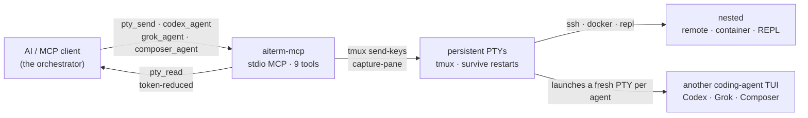

<p align="center">
  
</p>

# aiterm-mcp

[](https://github.com/kitepon-rgb/aiterm-mcp/actions/workflows/ci.yml)
[](https://www.npmjs.com/package/aiterm-mcp)
[](https://nodejs.org)
[](LICENSE)
[](https://packagephobia.com/result?p=aiterm-mcp)

> *(English: [README.md](README.md))*

> **あなたの AI に、ほかの AI を操らせる。** Claude Code から——あるいは任意の MCP クライアントから——1 回の呼び出しで、コーディングエージェント（Codex・Grok・Composer）を永続端末の中に起動し、操作用のセッションを手渡す。何をしているかをトークン削減して読み、次の指示を送る。
>
> **これは何か:** AI が握る 1 本の永続 MCP 端末——その中に他のコーディングエージェントも起動できる。`ssh`・`docker exec`・REPL・別エージェントの TUI は、すべてその 1 本の端末の中へ「送るだけのテキスト」として入れ子になる。仕組みはあえて素朴——MCP クライアントが相手エージェントの端末を 1 ターンずつ操作するだけ。隠れたプロトコルも・共有メモリも・自律的な交渉も無い。
>
> **人が tmux に張り付く必要はない。** aiterm は MCP 越しにプログラムから駆動されるので、「AI が別のエージェントを起動して操作する」のに端末の前に誰も座らなくていい——オーケストレーションのループ・CI ステップ・cron から動かせる。
>
> *MCP = Model Context Protocol — Claude Code のようなツールが AI に機能を差し込むためのオープン標準。*

9 ツール: 6 つの **PTY ツール**（`pty_open` / `pty_send` / `pty_read` / `pty_key` / `pty_close` / `pty_list`）で 1 本の永続端末を開き・操作し・読む。加えて 3 つの **エージェント起動ツール**（`codex_agent` / `grok_agent` / `composer_agent`）が、別のコーディングエージェントの TUI を新しい端末の中に起動する。バックエンドは **tmux** なので、MCP サーバや AI クライアントが再起動してもセッションは生き残る。

**状態:** 開発継続中 · この分野では新参で、別の形に賭けている（[既存手段との比較](#既存手段との比較)参照）· 動作対象は Linux · WSL2 · macOS · Windows ネイティブ · MIT · [変更履歴](CHANGELOG.md)。

## なぜ今

2026 のエージェントツールの多くはオーケストレーションへ寄っていっている——先導するモデルが機械的なリファクタを Codex に委ね、一括編集を Composer に走らせながら自分は diff をレビューし、1 つのタスクを複数エージェントに分散して自分のコンテキスト窓を守る。そうしたエージェントはどれも既に端末の中に住んでいる。aiterm はその端末を一級の・MCP ネイティブなツールにする——だから指揮するモデルは、**人がペインを配線しなくても他のエージェントを起動して操れる。**

## 2 つの使い方

### 1. SSH・コンテナ・REPL を 1 本の永続端末で操作する — 土台

これが土台で、tmux だけで動く——他の CLI は要らない。`pty_open` がローカル端末を 1 個握り、`ssh host`・`docker exec -it x bash`・REPL は、その中へ `pty_send` で打ち込む「ただのテキスト」——**一度だけ**。以降のコマンドは同じ認証済みセッションを通る。セッション種別をツールで区別しない。

```
pty_open()                         → ローカル端末を 1 個握る
pty_send(id, "ssh 192.168.1.2")    → その端末の中で一度だけ認証して入る
pty_send(id, "uname -a")           → 以降のコマンドは同じセッションを通る
pty_read(id, { wait: true })       → 削減済みの出力を読む（完了検出つき）
```

<sub>**起源.** これのために aiterm を作った。自宅サーバを Claude Code からコマンド 1 個ずつ叩くと、SSH コマンドは毎回「接続→認証→切断」になる——鍵のパスフレーズもワンタイムコードも毎回打ち直し、短命セッションが増殖し、やがて自分の防御（`fail2ban`・`MaxStartups`/`MaxSessions`・アカウントロック）に締め出される——攻撃者を止める仕組みに自分が止められる。1 本の認証済みセッションを握れば 3 つとも一度に消える。この痛みがこの永続端末が存在する理由で、その中に丸ごと別のエージェントを起動するのは、そこから育った姿だ。</sub>

### 2. その端末の中に他のコーディングエージェントを起動する — オーケストレーションの旗艦

同じ primitive が別エージェントの TUI を宿す。3 つの起動ツールが、各ベンダーの対話型コーディングエージェント TUI を新しい永続端末の中に起動し、`session_id` を返す。以後はどのシェルとも同じ `pty_read` / `pty_send` で操作する——出力をトークン削減して読み、次の一手を送る。（TUI は全画面アプリなので `pty_read({ screen: true })` で描画済みの画面が得られる。）これはベンダー自身の CLI が導入・認証済みであることが必要——[要件](#要件)参照。

```text
codex_agent({ session_name: "codex1", cwd: "/repo",
              prompt: "port test/legacy.py to vitest" })
                                    → { session_id: "codex1", … }   # Codex が永続端末で稼働開始
pty_read("codex1", { screen: true })   → 何をしているか読む（トークン削減）
pty_send("codex1", "also fix the imports it broke")   → 作業の途中で操舵する——TUI を操作している
```

モデルごとに 1 ツール＝ツール名を見ればどのモデルか分かる:

| ツール | 起動するもの | 主な引数 |
| --- | --- | --- |
| `codex_agent` | Codex CLI（OpenAI・モデルは CLI の既定） | `prompt?`, `reasoning_effort?`, `cwd?`, `session_name?` |
| `grok_agent` | Grok Build の `grok-build` モデル（xAI） | `prompt?`, `reasoning_effort?`（`low`/`medium`/`high`/`xhigh`/`max`）, `cwd?`, `session_name?` |
| `composer_agent` | Grok Build の `grok-composer-2.5-fast` モデル（xAI） | `grok_agent` と同じ |

各ベンダーの CLI が導入・認証済みであること（`codex_agent` は `codex`、Grok 系 2 つは `grok`）。バイナリは `CODEX_BIN` / `GROK_BIN` → `~/.local/bin/codex` / `~/.grok/bin/grok` → `PATH` の順で解決する。前提は **session を作る前に**検証する——`grok_agent` / `composer_agent` は範囲外の `reasoning_effort` を先に弾き（値集合は固定＝`low`/`medium`/`high`/`xhigh`/`max`）、CLI バイナリ不在・実在しない `cwd` は 3 つとも失敗する。前提（`reasoning_effort`・バイナリ・`cwd`）で弾かれた起動は **session の残骸をゼロ**にして返し、起動キーストロークを送れなければ session を畳む。（その先でベンダー CLI が実際に立ち上がったか・認証できたかは aiterm は検証しない——`openAgent` は起動コマンドを送った時点で返る。起動できたかは session を読んで確認する。）（`codex_agent` は Codex の受理値が版で変わるため、`reasoning_effort` を検証せず config override〔`-c model_reasoning_effort=…`〕として Codex CLI へ渡す。）`cwd` は絶対パスで渡す——`~` は展開されない。

**Claude launcher はあえて無い**し、エージェント間のプロトコルも無い: aiterm の役目は、あなたの Claude（や任意の MCP クライアント）が*他の*エージェントに手を伸ばして端末を操作できるようにすること。起動したエージェントは単なるもう 1 本の永続セッションなので、この README の他のすべて（トークン削減読取・完了検出・人の `attach` での監視/介入）がそのまま効く。

## デモ

<p align="center">
  
</p>

リポジトリ内で今このツールに実際に通した本物の採取——数値も省略マーカーも各 `is_complete` の判定も、すべてツール自身の出力で、モックではない。角括弧のメタ行は `pty_read` が実際に付けるもの（この日本語 README ではメタ行を実出力のまま載せている。英語版は可読性のため訳出している）。

長い出力を head+tail に畳む——中間を省いているのは私でなく reducer（166 → 56 トークン）:

```text
→ pty_send("demo", "seq 1 150")
→ pty_read("demo", { wait: true })
← 1
  2
  3
  ⋮  （head は 29 行目まで続く——この README では省略表示）
  … 〈102 行省略。全文は full=true、範囲は line_range="A:B"〉 …    ← ツール自身のマーカー
  ⋮  （tail は 132 行目から再開——この README では省略表示）
  149
  150
  [aiterm demo: 51 行 / ~56 tok (raw 152 行 / ~166 tok); 102 行 hidden] [is_complete=True via quiescent]
```

`grep` を、コマンド別 reducer で「件数ヘッダ＋ヒット行だけ」に畳む:

```text
→ pty_send("demo", "grep -rn capture-pane src/ test/")
→ pty_read("demo", { wait: true, rtk: true })
← 2 matches in 1 files:

  src/core.ts:159:// maxBuffer は既定 1MiB。capture-pane（大きなスクロールバック）… （行はここで truncate）
  src/core.ts:335:const args = ["capture-pane", "-p", "-J", "-t", name];
  [aiterm demo: rtk:grep 適用 / ~46 tok (raw ~53 tok)] [is_complete=True via quiescent]
```

ネストは「中へ送るただのテキスト」——同じ PTY の*中で* Python REPL に入る（`ssh host`・`docker exec -it … bash`・起動したコーディングエージェントの TUI も、まったく同じ要領でネストする）:

```text
→ pty_send("demo", "python3")
→ pty_read("demo", { until: ">>>" })              # 入れ子側のプロンプト = 「内側シェルが応答できる」
→ pty_send("demo", "print(sum(range(1_000_000)))")
→ pty_read("demo", { wait: true, until: ">>>" })
← 499999500000                                     [is_complete=True via until]
```

上の採取で私が触ったのは 2 本の `⋮` 行（長い head/tail を README 用に省略）と長すぎる grep 行 1 本の truncate だけ——`〈…〉` マーカー・トークン数・各 `is_complete` はツールが出した通り。（`until` は末尾スペース無しの `">>>"` を使う——採取されるプロンプトは末尾が削られるので `">>> "` だと外れて `timeout` に落ちる。）ネスト中は `until`（内側プロンプト）か `mark: true` を渡すこと——そこでは quiescence が原理的に効かないため（[完了検出](#完了検出5-層) / [既知の制約](#既知の制約バグではなく仕様)）。同じ tmux ソケットに人が `attach` すれば、これらをライブで覗ける（[人が覗く](#人が覗く)）。

## クイックスタート（約60秒）

Claude Code なら 1 コマンドで登録——clone もビルドも不要、`npx` が毎回取得して起動する:

```bash
claude mcp add --scope user --transport stdio aiterm -- npx -y aiterm-mcp
```

Claude Code を再起動して、接続を確認:

```bash
/mcp        # aiterm が connected・9 ツール公開、と出る
```

最初のセッション——4 回の呼び出しで、1 個の永続端末:

```text
pty_open()                          → { session_id: "t1", attach: "tmux -S … attach -t t1" }
pty_send("t1", "echo hello")        → PTY にコマンドを送る
pty_read("t1", { wait: true })      → "hello"   （トークン削減・完了検出つき）
pty_close("t1")                     → 端末を解放
```

これだけ。`t1` の端末は本物で永続——`ssh`・`docker exec`・REPL・起動したエージェントの TUI は、そこに住む「もの」に過ぎない。代わりにワーカーのエージェントを起動するのも 1 コール: `codex_agent()` が返す `session_id` を、同じ `pty_read` / `pty_send` で操作する。

**グローバル導入や別クライアントが良い場合は:**

```bash
# グローバル導入してコマンド名で登録
npm i -g aiterm-mcp
claude mcp add --scope user --transport stdio aiterm -- aiterm-mcp
```

`~/.claude.json` に登録され、初回に承認プロンプトが出る。**他の MCP クライアント**（Cursor / Cline / Claude Desktop …）でも同様に動くはず——stdio で `npx -y aiterm-mcp`（または `aiterm-mcp`）を起動するだけ。**Node ≥ 18** と **tmux** が必要——[要件](#要件)参照。

## ヘッドレス: 端末に人が居ない

MCP クライアントが aiterm を stdio 越しにプログラムから駆動するので、上のすべては **tmux に誰も座らないまま**動く。あなたの Claude Code セッションは、`codex_agent()` でタスクを起こし、`pty_read` で結果を読み、それを使って動ける——無人で。これは、人が操作する端末が向かない場所にこそ aiterm が合うということ:

- **複数エージェントのオーケストレーション** — 統括役がサブタスクを Codex / Grok / Composer に渡し、各々を専用の永続セッションに置き、全部を読み戻す。
- **CI** — ジョブのステップがエージェントを起こし、操作し、片付けられる。
- **cron** — スケジュール実行がエージェントを起動して出力を回収できる。

端末は本物で共有されているので、人が*割り込むことも*できる（[人が覗く](#人が覗く)）——が、人を必要とはしない。

## 仕組み



primitive は「PTY を 1 個握る」ことだけ。それ以外——SSH・コンテナ・REPL・起動したエージェント TUI——は、永続端末の中で動く「対話的な何か」に過ぎず、同じ `pty_send` / `pty_read` で操作する。各起動ツールは自分専用の新しい PTY を開く。PTY は tmux 上にあるので、MCP サーバや AI クライアントが再起動してもセッションは生き残る。

## 既存手段との比較

aiterm は 2 つの系譜の交点にいる——端末を操作する MCP サーバと、より新しい「エージェント同士が共有端末越しに会話する」という発想（[aiterm の立ち位置](#aiterm-の立ち位置)参照）。各軸の並びはこうなる——相手が強い所も含めて、正直に。

|  | **aiterm-mcp** | 1 コマンド毎の往復<br/>(例: `mcp-server-commands`) | terminal / SSH / tmux MCP<br/>(例: `iterm-mcp`, `ssh-mcp`, `tmux-mcp`) | 共有 tmux でエージェント同士<br/>(例: `smux`) |
| --- | --- | --- | --- | --- |
| 永続セッション | ✅ tmux・再起動を跨ぐ | ❌ 毎回新シェル | ⚠️ まちまち | ✅ tmux |
| SSH / コンテナ / REPL | `pty_send` 1 回でネスト | 毎コマンド接続し直し | ⚠️ ツールが分かれがち | ✅ tmux（人が操作） |
| 1 コールで別エージェント起動 | ✅ `codex_agent` / `grok_agent` / `composer_agent` | ❌ | ❌ | ⚠️ 人が動かす tmux に CLI + skills で参加 |
| ヘッドレス（人が tmux に居ない） | ✅ MCP 駆動・プログラム的 | ✅ | ⚠️ まちまち | ❌ 人が tmux に居る前提 |
| MCP ネイティブ（任意の MCP クライアント） | ✅ `claude mcp add` 1 行 | ✅ | ✅（MCP なので） | ❌ tmux 設定 + CLI + Agent Skills |
| トークン削減読取 | ✅ コマンド別 reducer | ❌ 生出力 | ⚠️ ほぼ無し | ❌ 生 tmux |
| 完了検出 | 5 層: 終了 / `mark` / `until` / 静止 / timeout | 無し（毎回ブロック） | ⚠️ プロンプト一致・脆い | ❌ エージェントがペインを読む |
| 破壊コマンド遮断 | ✅ tripwire（`force` で越える） | ❌ | ⚠️ まちまち | ❌ |
| 人が同時操作 | ✅ 共有 tmux ソケット（`attach`） | ❌ | ⚠️ まちまち | ✅（設計の芯） |

## aiterm の立ち位置

「エージェント同士が共有端末越しに会話する」は、それ自体が 1 つのカテゴリになりつつある——そして本当に良い発想だ。端末はどのコーディングエージェントも既に話せる普遍インタフェースで、専用のエージェント間プロトコルは要らない——シェル*そのもの*が共有面になる。`smux`（by @shawn_pana）はこの発想を、人が用意する 1 コマンドの共有 tmux 環境として広め、エージェントは `tmux-bridge` CLI と Agent Skills でそこに参加する。人が輪の中にいる共有ペインのワークフローに強く、実際に支持を集めている。

aiterm は同じ核心の洞察——端末を出会いの場にする——を取り、あえて 3 つの違う選択をした:

1. **ヘッドレスが前提。** aiterm は MCP 越しにプログラムから駆動されるので、「AI が別のエージェントを起動して操作する」のに *tmux に人が座らなくていい*——オーケストレーションのループ・CI ステップ・cron から動く。共有 tmux 系は人がキーボードの前に居ることを主軸にしていて（ドキュメントも対話的なペイン操作が中心）、無人運用は本来の姿ではない——aiterm はそれが本来の姿だ。
2. **MCP ネイティブ＝採用させるワークフローではない。** aiterm は stdio MCP サーバ: `claude mcp add` 1 行で、stdio を話す任意の MCP クライアントに構造化ツールとして刺さる（実機確認は Claude Code。Cursor / Cline / Claude Desktop も同じプロトコルなので同様に動くはず）。tmux 設定の採用も・ペイン操作の習得も・skills の導入も求めない——クライアントは既にツール呼び出しの仕方を知っている。
3. **エージェント起動が 1 ツールコール＝オーケストレーションの primitive。** `codex_agent()` が Codex を永続端末に起こし、すぐ操作できるセッションを返す。ペインを手で並べたり貼り付けたりしない——起動も・操舵も・読取も、指揮するモデルが自分で打てるツールコールだ。

その上に、生の tmux ブリッジには無い製品化レイヤが乗る: **トークン削減読取**・**5 層の完了検出**・**破壊コマンドの tripwire**。これらは人が tmux に居るモデルを否定しない——人がどこに立つかについての、別の・補完的な賭けだ。

## ツール

| ツール | 役割 | 主な引数 |
| --- | --- | --- |
| `pty_open` | 端末を 1 個握り `session_id` を返す | `name?`, `shell="bash"` |
| `pty_send` | テキスト(コマンド)を送る | `session_id`, `text`, `enter=true`, `mark`, `force`, `rtk`, `raw` |
| `pty_read` | 出力を削減して読む（既定は増分） | `session_id`, `wait`, `until`, `until_regex`, `timeout`, `screen`, `full`, `lines`, `line_range`, `raw`, `rtk` |
| `pty_key` | 制御キーを送る | `session_id`, `key`（`C-c`/`Enter`/`Up`…） |
| `pty_close` | セッションを閉じる | `session_id` |
| `pty_list` | セッション一覧 | （なし） |

### 対話エージェント起動ツール

各ツールは特定ベンダーの対話型コーディングエージェント TUI を新しい永続 PTY の中に起動し、`session_id` を返す。以後は他のセッションと同様に `pty_read` / `pty_send` で操作する。モデルごとに 1 ツール＝ツール名を見ればどのモデルか分かる。TUI は全画面アプリなので、`pty_read({ screen: true })` で描画済みの画面を読む。

| ツール | 起動するもの | 主な引数 |
| --- | --- | --- |
| `codex_agent` | Codex CLI（OpenAI・モデルは CLI の既定） | `prompt?`, `reasoning_effort?`, `cwd?`, `session_name?` |
| `grok_agent` | Grok Build の `grok-build` モデル（xAI） | `prompt?`, `reasoning_effort?`（`low`/`medium`/`high`/`xhigh`/`max`）, `cwd?`, `session_name?` |
| `composer_agent` | Grok Build の `grok-composer-2.5-fast` モデル（xAI） | `grok_agent` と同じ |

各ベンダーの CLI が導入・認証済みであること（`codex_agent` は `codex`、Grok 系 2 つは `grok`）。バイナリは `CODEX_BIN` / `GROK_BIN` → `~/.local/bin/codex` / `~/.grok/bin/grok` → `PATH` の順で解決する。前提はセッション作成前に検証し（grok/composer は範囲外の `reasoning_effort` を弾く。CLI 不在・実在しない `cwd` は 3 つとも失敗）、起動に失敗してもセッションの残骸は残さない。詳細は [その端末の中に他のコーディングエージェントを起動する](#2-その端末の中に他のコーディングエージェントを起動する--オーケストレーションの旗艦)。`cwd` は絶対パスで渡す——`~` は展開されない。

### 完了検出（5 層）

`pty_read({ wait: true })` は、プロセス終了 / `mark:true` sentinel の自動検出（後述）/ `until` 一致（**既定はリテラル部分一致**、`until_regex: true` で正規表現）/ 出力静止 ∧ シェル復帰（quiescence）/ timeout の 5 層で「コマンドが終わったか」を判定する。ネスト中（SSH・コンテナ・REPL・起動したエージェントの TUI の中）はシェル復帰判定が効かないので、`until` で内側プロンプトを指定するか、`mark: true` で送れば `pty_read({ wait: true })` が sentinel を自動検出する（until 不要・ネストでも効く）——全画面のエージェント TUI なら、出力が落ち着いた時点で `{ screen: true }` を読む。

### トークン削減

- `pty_read` は既定で制御文字除去・連続重複圧縮・head+tail 折りたたみ（＋復元ヒント・メタ併記）をかける。
- `pty_read({ rtk: true })` は直前に送ったコマンド別の reducer（`git status`/`git log`/`grep`/`pytest` ほか）で観測出力をさらに縮約する（rtk バイナリ非依存・自前実装）。
- `pty_send({ rtk: true })` は既知コマンドを `rtk` 形に書き換えて送り、実行先に `rtk` があればソースで削減を効かせる（無ければ素通し）。

### 安全

`pty_send` は送信前に破壊的コマンド（`rm -rf /`, `mkfs`, `dd of=/dev/…`, `DROP TABLE` 等）を遮断し（`force: true` で越える）、ESC・ブラケットペースト終端などをサニタイズする。`pty_read` は既定で制御文字を無害化して返す（`raw: true` はバイトをそのまま返す）。これは**サンドボックスではなく tripwire**（[既知の制約](#既知の制約バグではなく仕様)参照）。

## 人が覗く

セッションは共有 tmux ソケット上にある。`pty_open`（および各エージェント起動ツール）の戻り値に表示される `tmux -S … attach -t <id>` で人間が同じ端末に入って介入できる（抜けるのは `Ctrl-b d`）——起動した Codex/Grok/Composer のセッションが走るのを覗いたり、作業の途中で AI からキーボードを奪ったりも。Windows ネイティブではセッションが WSL 内にあるため、表示は WSL 形（`wsl tmux -S … attach -t <id>`）になる。

## 要件

- **Node.js >= 18**
- **tmux**（実行時の前提。`tmux -V` で確認。未導入なら `apt install tmux` / `brew install tmux`）
  - **macOS / Linux / WSL2** は tmux を直接使う。macOS は同梱されないので `brew install tmux` で導入する。MCP クライアントがターミナルでなく **GUI から起動**された場合、Homebrew の bin（Apple Silicon: `/opt/homebrew/bin`、Intel: `/usr/local/bin`）が `PATH` に入らないことがある。その場合 aiterm が自動で探索するか、**`AITERM_TMUX=/path/to/tmux`** で明示指定する。
  - **Windows ネイティブ**には tmux が無いため、aiterm は裏で **WSL の中の tmux** を透過的に使う。[WSL](https://learn.microsoft.com/ja-jp/windows/wsl/) を導入・初期化し、**WSL のディストリ内に tmux を入れる**こと（`sudo apt install tmux`）。`wsl tmux -V` で確認できる。セッション・ソケット・人の `attach` はすべて WSL 側にあり、AI は Windows 側のコマンドから操作するだけ。（Windows のツールは SSH と同じく入れ子で握る: `pty_send "powershell.exe …"` で PowerShell に入る。）
- **エージェント起動ツール**を使う場合: 対応するベンダー CLI が導入・認証済みであること——`codex_agent` は `codex`、`grok_agent` / `composer_agent` は `grok`。（PTY ツールだけ使うなら不要。）
- 任意: [`rtk`](https://github.com/rtk-ai/rtk) バイナリ（`pty_send` の `rtk: true` 委譲で使う。無くても動く）

## 既知の制約（バグではなく仕様）

- **ネスト中（ssh / docker / REPL / 起動したエージェント TUI）は quiescence が原理的に効かない。** 前面コマンドがシェル集合（bash/sh/zsh/fish/dash）の外になるため。ネスト中で `until` も `mark` も無いときは、待っても完了を確定できる信号が無いので、`pty_read({ wait: true })` はフル `timeout` を空費せず出力静止時点で `is_complete=False via nested` と早期に返し、`until`（既定リテラル部分一致・`until_regex: true` で正規表現）か `mark: true`（終了コード付き sentinel・自動検出）の指定を促す。全画面のエージェント TUI なら、出力が落ち着いた時点で `{ screen: true }` を読む。
- **`is_complete=False` は失敗ではない。** 「timeout 内に完了を観測できなかった」という意味。長時間コマンドでは `timeout` を伸ばすか `until`/`mark` を使う。
- **破壊ゲートはサンドボックスではなく tripwire。** よくある破壊形だけを弾く。相対パスの `rm`、`$VAR` 展開後に危険化するもの、ssh 先で実行されるコマンドは捕捉しない——起動したコーディングエージェントが自分のセッション内で何をするかも取り締まらない。
- **エージェント起動ツールはベンダー TUI を起動するだけで、包んだり代理したりしない。** aiterm は前提を検証して CLI を永続 PTY で起動する——モデル・認証・挙動はベンダー CLI のもの。`claude` の起動ツールは無く、エージェント間のプロトコルも無い。「会話」とは、あなたの MCP クライアントが TUI を操作すること（入力を送り、出力を読む）だ。
- **`pty_send({ rtk: true })` は単行コマンドのみ＋外部 `rtk` バイナリが必要**（無ければ素通し）。一方 `pty_read({ rtk: true })` の reducer は自前実装で rtk 非依存。
- **`pytest` reducer は件数・罫線・`FAILURES` ブロック整形が rtk 0.42.0 と byte 一致**（回帰テストで固定）。ただし `-ra`/`-rf` 時の `FAILED` 要約行の理由は**全文を保持する**（rtk 0.42.0 は最初の `" - "` 区切りで切るが、本実装は可読性優先で情報を残すため、この行は意図的に rtk と完全一致させない）。rtk が大出力時に付ける `[full output: …]`（tee ポインタ）行は read 側では再現しない。
- **tmux は `-f /dev/null` 起動**なので `~/.tmux.conf` を読まない（環境差を排除するため）。
- **全セッションが単一 socket（POSIX では `claude.sock`）上にある。** `tmux … kill-server` は全セッションを消す。

## 開発

```bash
npm install
npm run build      # tsc → dist/
npm test           # build してから node:test 回帰スイート（tmux 必須）
npm link           # ローカルで `aiterm-mcp` を PATH に
```

ロジックは `src/core.ts`（tmux 制御・削減・完了検出・安全・エージェント起動）と `src/rtk.ts`（コマンド別 reducer）、公開は `src/index.ts`。設計の出発点と reducer の移植元（pytest reducer は本家 rtk 0.42.0 と一致するよう移植・ただし上記の `FAILED` 行の差異は意図的・回帰テストで固定）は `prototype/python/` を参照。

## 試す

1 コマンド、clone もビルドも不要:

```bash
claude mcp add --scope user --transport stdio aiterm -- npx -y aiterm-mcp
```

aiterm が、あなたの AI に別のエージェントへ仕事を渡させたなら——あるいはトークンの往復を 1 回でも省けたなら——**[リポジトリに star](https://github.com/kitepon-rgb/aiterm-mcp)** を。他の人に見つけてもらう一番安い方法です。

- **npm:** https://www.npmjs.com/package/aiterm-mcp
- **Issue / バグ報告:** https://github.com/kitepon-rgb/aiterm-mcp/issues

## ライセンス

MIT
