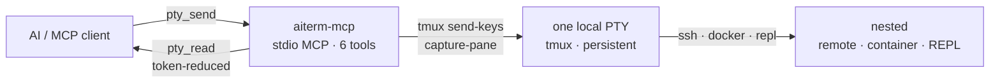

<p align="center">
  
</p>

# aiterm-mcp

[](https://github.com/kitepon-rgb/aiterm-mcp/actions/workflows/ci.yml)
[](https://www.npmjs.com/package/aiterm-mcp)
[](https://nodejs.org)
[](LICENSE)
[](https://www.npmjs.com/package/aiterm-mcp)
[](https://packagephobia.com/result?p=aiterm-mcp)

> *(English: [README.md](README.md))*

> AI が握る**ローカル永続端末**を stdio MCP サーバとして公開する。1 個のローカル端末を握り、SSH もコンテナも「その端末に打つ 1 コマンド」に格下げする。読み取りはトークン削減つき。

`pty_open` / `pty_send` / `pty_read` / `pty_key` / `pty_close` / `pty_list` の 6 ツールだけ。バックエンドは tmux なので、MCP サーバや AI クライアントが再起動してもセッションは生き残る。

## クイックスタート（約60秒）

Claude Code なら 1 コマンドで登録 — clone もビルドも不要、`npx` が毎回取得して起動する:

```bash
claude mcp add --scope user --transport stdio aiterm -- npx -y aiterm-mcp
```

Claude Code を再起動して、接続を確認:

```bash
/mcp        # aiterm が connected・6 ツール公開、と出る
```

最初のセッション — 4 回の呼び出しで、1 個の永続端末:

```text
pty_open()                          → { session_id: "t1", attach: "tmux -S … attach -t t1" }
pty_send("t1", "echo hello")        → PTY にコマンドを送る
pty_read("t1", { wait: true })      → "hello"   （トークン削減・完了検出つき）
pty_close("t1")                     → 端末を解放
```

これだけ。`t1` の端末は本物で永続 — `ssh`・`docker exec`・REPL は、そこへ `pty_send` で打ち込む“ただのテキスト”（[なぜ](#なぜ)）。インストールも不要にしたいなら、どの MCP クライアントからでも stdio で `npx -y aiterm-mcp` を起動するだけ。

## インストール

npm に公開済み。clone もビルドも不要:

```bash
# Claude Code — 推奨（インストール不要、npx が毎回取得して起動）
claude mcp add --scope user --transport stdio aiterm -- npx -y aiterm-mcp

# またはグローバル導入してコマンド名で登録
npm i -g aiterm-mcp
claude mcp add --scope user --transport stdio aiterm -- aiterm-mcp
```

**Node ≥ 18** と **tmux** が必要（Windows ネイティブでは WSL とその中の tmux。下の「要件」参照）。他の MCP クライアントは stdio で `npx -y aiterm-mcp` を起動するだけ（詳細は下の「インストール / 登録」）。

## なぜ

AI にコマンドを 1 個ずつ投げて結果を受け取る往復は、SSH では毎回「接続→認証→切断」を繰り返し遅く、トークンも食う。aiterm は **1 個の PTY を永続的に握り**、その中で `ssh host` や `docker exec -it x bash` と打って入る（ネスト）。セッション種別をツールで区別しない。

```
pty_open()                         → ローカル端末を 1 個握る
pty_send(id, "ssh 192.168.1.2")    → その端末の中で SSH に入る
pty_send(id, "uname -a")           → リモートで実行
pty_read(id, { wait: true })       → 削減済みの出力を読む
```

## デモ

<!-- demo gif: drop docs/demo.gif here (asciinema cast or animated GIF of the flow below) -->

決め手の流れ: PTY を 1 個開き、その**中で** SSH にネストし、リモートでコマンドを実行し、**すでにトークン削減された**出力を読む — コマンドごとの接続し直しは無い。

```text
# 1 — ローカル端末を 1 個握る（tmux 上・再起動を跨ぐ）
→ pty_open()
← { session_id: "t1", attach: "tmux -S /…/claude.sock attach -t t1" }

# 2 — その同じ端末の中で SSH にネスト（別ツールではない）
→ pty_send("t1", "ssh 192.168.1.2")
← sent
→ pty_read("t1", { until: "\\$ $" })          # リモートのプロンプト = 「シェルに戻った」
← user@remote:~$

# 3 — 同じ PTY のまま、リモートでコマンド実行（接続し直し無し）
→ pty_send("t1", "uname -a")
→ pty_read("t1", { until: "\\$ $" })
← Linux remote 6.1.0 #1 SMP x86_64 GNU/Linux

# 4 — ノイズの多いコマンドを、コマンド別 reducer で読む
→ pty_send("t1", "git status")
→ pty_read("t1", { until: "\\$ $", rtk: true }) # 自前実装・rtk バイナリ不要
← ## main…origin/main [ahead 1]
   M src/core.ts
   ?? notes.txt
   [reduced: 制御文字除去 · 重複圧縮 · git-status reducer]
```

この流れが「デモのための嘘」にならない理由:

- ステップ 2/3 が **`until`**（リモートのプロンプト）を使うのは、**ネスト中は quiescence が原理的に効かない**ため（[完了検出](#完了検出4-層) / [既知の制約](#既知の制約バグではなく仕様)）。ローカルシェルなら `{ wait: true }` だけで足りるが、ネスト中は `until`（または `mark: true`）が要る。
- 角括弧の `[reduced: …]` 行は `pty_read` が付けるメタ/復元ヒントの例示で、実際の文言は出力に応じて変わる。reducer は **自前実装**の `pty_read({ rtk: true })` 経路で、外部 `rtk` バイナリは不要。
- `t1` のソケットに人が `attach` すれば、同じ SSH セッションをライブで覗ける（[人が覗く](#人が覗く)）。

## 仕組み



プリミティブは「PTY を 1 個握る」ことだけ。SSH・コンテナ・REPL は、その中へ `pty_send` で打ち込む“ただのテキスト”に過ぎない。PTY は tmux 上にあるので、MCP サーバや AI クライアントが再起動してもセッションは生き残る。

## 既存手段との比較

| | **aiterm-mcp** | 1 コマンド毎の往復 | 一般的な terminal / tmux MCP |
| --- | --- | --- | --- |
| 永続セッション | ✅ tmux・再起動を跨ぐ | ❌ 毎回新シェル | ⚠️ まちまち |
| SSH / コンテナ | `pty_send` 1 回でネスト | 毎コマンド接続し直し | ⚠️ ツールが分かれがち |
| トークン削減読取 | ✅ コマンド別 reducer | ❌ 生出力 | ⚠️ ほぼ無し |
| 完了検出 | 4 層: 終了 / `until` / 静止 / timeout | 無し（毎回ブロック） | ⚠️ プロンプト一致・脆い |
| 人が同時操作 | ✅ 共有 tmux ソケット | ❌ | ⚠️ まちまち |

## 要件

- **Node.js >= 18**
- **tmux**（実行時の前提。`tmux -V` で確認。未導入なら `apt install tmux` / `brew install tmux`）
  - **macOS / Linux / WSL2** は tmux を直接使う。macOS は同梱されないので `brew install tmux` で導入する。MCP クライアントがターミナルでなく **GUI から起動**された場合、Homebrew の bin（Apple Silicon: `/opt/homebrew/bin`、Intel: `/usr/local/bin`）が `PATH` に入らないことがある。その場合 aiterm が自動で探索するか、**`AITERM_TMUX=/path/to/tmux`** で明示指定する。
  - **Windows ネイティブ**には tmux が無いため、aiterm は裏で **WSL の中の tmux** を透過的に使う。[WSL](https://learn.microsoft.com/ja-jp/windows/wsl/) を導入・初期化し、**WSL のディストリ内に tmux を入れる**こと（`sudo apt install tmux`）。`wsl tmux -V` で確認できる。セッション・ソケット・人の `attach` はすべて WSL 側にあり、AI は Windows 側のコマンドから操作するだけ。（Windows のツールは SSH と同じく入れ子で握る: `pty_send "powershell.exe …"` で PowerShell に入る。）
- 任意: [`rtk`](https://github.com/rtk-ai/rtk) バイナリ（`pty_send` の `rtk: true` 委譲で使う。無くても動く）

## インストール / 登録

Claude Code（CLI）にユーザースコープ（全プロジェクトで利用可）で登録する例:

```bash
# 推奨: インストール不要、npx が毎回取得して起動
claude mcp add --scope user --transport stdio aiterm -- npx -y aiterm-mcp

# またはグローバルインストールしてコマンド名で
npm i -g aiterm-mcp
claude mcp add --scope user --transport stdio aiterm -- aiterm-mcp
```

`~/.claude.json` に登録される。Claude Code を再起動すると、初回に承認プロンプトが出る。`/mcp` で接続状態を確認できる。

他の MCP クライアントでも、stdio で `npx -y aiterm-mcp`（または `aiterm-mcp`）を起動するだけ。

## ツール

| ツール | 役割 | 主な引数 |
| --- | --- | --- |
| `pty_open` | 端末を 1 個握り `session_id` を返す | `name?`, `shell="bash"` |
| `pty_send` | テキスト(コマンド)を送る | `session_id`, `text`, `enter=true`, `mark`, `force`, `rtk`, `raw` |
| `pty_read` | 出力を削減して読む（既定は増分） | `session_id`, `wait`, `until`, `timeout`, `screen`, `full`, `lines`, `line_range`, `raw`, `rtk` |
| `pty_key` | 制御キーを送る | `session_id`, `key`（`C-c`/`Enter`/`Up`…） |
| `pty_close` | セッションを閉じる | `session_id` |
| `pty_list` | セッション一覧 | （なし） |

### 完了検出（4 層）

`pty_read({ wait: true })` は、プロセス終了 / `until` 正規表現一致 / 出力静止 ∧ シェル復帰（quiescence）/ timeout の 4 層で「コマンドが終わったか」を判定する。ネスト中（SSH 先）はシェル復帰判定が効かないので `until` でプロンプトを指定すると綺麗に判定できる。

### トークン削減

- `pty_read` は既定で制御文字除去・連続重複圧縮・head+tail 折りたたみ（＋復元ヒント・メタ併記）をかける。
- `pty_read({ rtk: true })` は直前に送ったコマンド別の reducer（`git status`/`git log`/`grep`/`pytest` ほか）で観測出力をさらに縮約する（rtk バイナリ非依存・自前実装）。
- `pty_send({ rtk: true })` は既知コマンドを `rtk` 形に書き換えて送り、実行先に `rtk` があればソースで削減を効かせる（無ければ素通し）。

### 安全

`pty_send` は送信前に破壊的コマンド（`rm -rf /`, `mkfs`, `dd of=/dev/…`, `DROP TABLE` 等）を遮断し（`force: true` で越える）、ESC・ブラケットペースト終端などをサニタイズする。`pty_read` は制御文字を無害化して返す。

## 既知の制約（バグではなく仕様）

- **ネスト中（ssh / docker / REPL）は quiescence が原理的に効かない。** 前面コマンドがシェル集合（bash/sh/zsh/fish/dash）の外になるため。完了検出は `until`（プロンプト等の正規表現）か `mark: true`（終了コード付き sentinel）を使う。
- **`is_complete=False` は失敗ではない。** 「timeout 内に完了を観測できなかった」という意味。長時間コマンドでは `timeout` を伸ばすか `until`/`mark` を使う。
- **破壊ゲートはサンドボックスではなく tripwire。** よくある破壊形だけを弾く。相対パスの `rm`、`$VAR` 展開後に危険化するもの、ssh 先で実行されるコマンドは捕捉しない。
- **`pty_send({ rtk: true })` は単行コマンドのみ＋外部 `rtk` バイナリが必要**（無ければ素通し）。一方 `pty_read({ rtk: true })` の reducer は自前実装で rtk 非依存。
- **`pytest` reducer は件数・罫線・`FAILURES` ブロック整形が rtk 0.42.0 と byte 一致**（回帰テストで固定）。ただし `-ra`/`-rf` 時の `FAILED` 要約行の理由は**全文を保持する**（rtk 0.42.0 は最初の `" - "` 区切りで切るが、本実装は可読性優先で情報を残すため、この行は意図的に rtk と完全一致させない）。rtk が大出力時に付ける `[full output: …]`（tee ポインタ）行は read 側では再現しない。
- **tmux は `-f /dev/null` 起動**なので `~/.tmux.conf` を読まない（環境差を排除するため）。
- **全セッションが単一 socket（`claude.sock`）上にある。** `tmux … kill-server` は全セッションを消す。

## 人が覗く

セッションは共有 tmux ソケット上にある。`pty_open` の戻り値に表示される `tmux -S … attach -t <id>` で人間が同じ端末に入って介入できる（抜けるのは `Ctrl-b d`）。Windows ネイティブではセッションが WSL 内にあるため、表示は WSL 形（`wsl tmux -S … attach -t <id>`）になる。

## 開発

```bash
npm install
npm run build      # tsc → dist/
npm test           # build してから node:test 回帰スイート（tmux 必須）
npm link           # ローカルで `aiterm-mcp` を PATH に
```

ロジックは `src/core.ts`（tmux 制御・削減・完了検出・安全）と `src/rtk.ts`（コマンド別 reducer）、公開は `src/index.ts`。設計の出発点と reducer の移植元（pytest reducer は本家 rtk 0.42.0 と出力が byte 一致するよう移植・回帰テストで固定）は `prototype/python/` を参照。

## 試す

1 コマンド、clone もビルドも不要:

```bash
claude mcp add --scope user --transport stdio aiterm -- npx -y aiterm-mcp
```

aiterm がトークンの往復を 1 回でも省けたなら、**[リポジトリに star](https://github.com/kitepon-rgb/aiterm-mcp)** を — 他の人に見つけてもらう一番安い方法です。

- **npm:** https://www.npmjs.com/package/aiterm-mcp
- **Issue / バグ報告:** https://github.com/kitepon-rgb/aiterm-mcp/issues

## ライセンス

MIT
