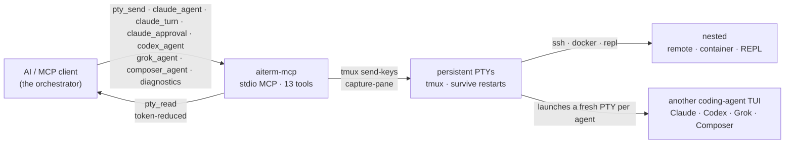

<p align="center">
  
</p>

# aiterm-mcp

[](https://github.com/kitepon-rgb/aiterm-mcp/actions/workflows/ci.yml)
[](https://www.npmjs.com/package/aiterm-mcp)
[](https://nodejs.org)
[](LICENSE)
[](https://packagephobia.com/result?p=aiterm-mcp)

> *(日本語: [README.ja.md](README.ja.md))*

> **Let your AI orchestrate other AIs.** From any MCP client, one call spawns a coding agent (Claude, Codex, Grok, or Composer) inside a persistent terminal and hands you a session to drive: read what it's doing token-reduced, send it the next instruction.
>
> **What it is:** one persistent MCP terminal your AI drives — and can launch other coding agents into. `ssh`, `docker exec`, a REPL, or another agent's TUI all nest inside that one terminal as just text you send in. The mechanism is deliberately plain — your MCP client drives the other agent's terminal turn by turn: no hidden protocol, no shared memory, no autonomous negotiation.
>
> **No human at a tmux required.** aiterm is driven programmatically over MCP, so an AI can launch and drive another agent with no one sitting in the terminal — from an orchestration loop, a CI step, or a cron job.
>
> *MCP = Model Context Protocol — the open standard that lets tools like Claude Code plug capabilities into an AI.*

**Factory role:** aiterm-mcp is one of the ten self-owned core products managed by
the dotagents development factory. It owns the persistent PTY and external-agent
execution lane; dotagents owns the cross-product installation and integration
contract.

**Measured, not claimed:** on this repo's own 203-test suite, a `pty_read` puts **~7.1× fewer tokens** in your context than the raw log — and the pass/fail verdict survives the fold. → [When to reach for it vs. the built-in shell](#when-to-reach-for-it-vs-the-built-in-shell)

Thirteen tools: six **PTY tools** — `pty_open` / `pty_send` / `pty_read` / `pty_key` / `pty_close` / `pty_list` — to open, drive, and read one persistent terminal, four **agent launchers** — `claude_agent` / `codex_agent` / `grok_agent` / `composer_agent` — that each start another coding agent's TUI inside a fresh one, `claude_turn` for durable structured issue/recovery, `claude_approval` for correlated managed-Claude approval prompts, and `diagnostics` for safe factory readiness. The backend is **tmux**, so sessions survive even if the MCP server or the AI client restarts.

**v0.19.2 was published on 2026-07-20.** The v0.19 line adds the correlated
managed-Claude approval relay, preserves multiline shell delivery, and extends
factory diagnostics on native Windows. The v0.18 line hardened agent dispatch
with `submit_residue`, tmux bracketed paste, and a ready gate that rejects busy
Codex/Claude screens. As of v0.16/0.17 a parent agent never blocks on aiterm:
every send to an agent session is a non-blocking dispatch, completion is one
universal `aiterm-wait` waiter whose exit codes mirror the receipt outcome
(`0`=done / `3`=timeout, not finished / `4`=closed), and a launch with an
initial prompt returns a ready-made `wait_command` in its structured receipt.
Factory diagnostics and the local runtime-error store collect only when
canonical dotagents config explicitly sets `collection.enabled: true`;
collection is off by default and performs no network I/O. It ships via
tag-triggered CI with npm provenance (OIDC Trusted Publishing); the GitHub
Release re-registers the Official MCP Registry entry.

**Status:** actively maintained · the newcomer here, betting on a different shape (see [vs. the alternatives](#vs-the-alternatives)) · runs on Linux · WSL2 · macOS · native Windows for the core PTY tools (managed completion is POSIX/WSL/macOS only for now) · MIT · see the [CHANGELOG](CHANGELOG.md).

## Why now

A lot of 2026's agent tooling is converging on orchestration: a lead model delegating a mechanical refactor to Codex, running Composer on a bulk edit while it reviews the diff, fanning one task across several agents to spare its own context window. All of those agents already live in a terminal. aiterm makes that terminal a first-class, MCP-native tool — so the model doing the orchestrating can **spawn and steer the others without a human wiring up panes.**

## Built with Codex and GPT-5.6 for OpenAI Build Week 2026

aiterm predates Build Week, so the event work is kept visible in dated commits. During the submission window (July 14–16, 2026), I extended it with safe serialized delivery for long PTY input, correlated operation IDs and bounded result recovery, machine-readable launch and idempotent close receipts, and a hardened readiness gate that prevents prompts from disappearing during TUI startup redraws. The public comparison from the pre-event release is [`v0.12.2...main`](https://github.com/kitepon-rgb/aiterm-mcp/compare/v0.12.2...main).

I used **Codex with GPT-5.6** as an engineering collaborator: it inspected the implementation, challenged the API and recovery contracts, generated focused regression cases, and helped verify race, security, timeout, and malformed-event paths. I reviewed the diffs and test evidence and retained the final product and architecture decisions. The result is a 262-test regression suite covering normal operation as well as failure and recovery behavior.

## Two ways to use it

### 1. Drive SSH, containers, and REPLs in one persistent terminal — the primitive

This is the base, and it works with just tmux — no other CLI. `pty_open` grabs one local terminal; `ssh host`, `docker exec -it x bash`, or a REPL are just text you `pty_send` into it — **once**. Every command after that rides the same already-authenticated session. Session kind is never a tool-level distinction.

```
pty_open()                         → grab one local terminal
pty_send(id, "ssh 192.168.1.2")    → authenticate once, inside that terminal
pty_send(id, "uname -a")           → every later command rides the SAME session
pty_read(id, { wait: true })       → read the token-reduced output, completion detected
```

<sub>**Origin.** I built aiterm for exactly this. Driving my homelab from Claude Code one command at a time meant every SSH command became its own `connect → authenticate → disconnect`: re-typing the passphrase and one-time code each time, short-lived sessions piling up, and eventually my own defenses (`fail2ban`, `MaxStartups`/`MaxSessions`, account lockout) locking me out — the security meant to stop attackers ended up stopping me. Holding one authenticated session fixes all three at once. That pain is why the persistent terminal exists; launching whole other agents inside it is what it grew into.</sub>

### 2. Launch other coding agents into that terminal — the orchestration flagship

The same primitive hosts another agent's TUI. Four launchers each start one vendor's interactive coding-agent TUI inside a fresh persistent terminal and return a `session_id`. Their existing human-readable text is accompanied by an `aiterm.agent-launch-result.v1` structured receipt, so durable callers never parse display text for the session handle; when the launch carries an initial `prompt`, the receipt also includes the `event_cursor`, a ready-made `wait_command` for the completion waiter, and a `submit_residue` observation (`true` = the prompt is likely still sitting unsubmitted in the composer — the hint explains recovery; `false` = no residue observed, not a proof of submission; `null` = not applicable). From there you drive it with the same `pty_read` / `pty_send` you'd use on any shell: read its output token-reduced, send it the next step. (The TUIs are full-screen apps, so `pty_read({ screen: true })` gives you the rendered view.) Every launch is **managed**: aiterm installs its own Stop hook, so turn completion is a first-class event. Sending to an agent session is a non-blocking **dispatch** — the call returns immediately with an `event_cursor`, and completion arrives via [`aiterm-wait`](#completion-push-for-parent-agents-aiterm-wait). Durable machine callers use `claude_turn({ action: "issue" | "recover", session_id, operation_id, ... })`: it returns fixed `accepted` / `pending` / `completed` / `unknown` states without parsing human-facing errors, never resends during recovery, and includes exact `raw_output` only for a verified completion. The same operation ID is carried through the dispatch receipt, active marker, Stop event, and result. The ordinary `pty_send` / `pty_read` surface remains available for interactive callers and humans. `C-c` keeps the marker for a delayed Stop; if no Stop arrives, close the session. An initial `prompt` on `claude_agent`/`codex_agent` is submitted through the same ready gate and the launcher returns without waiting; on Grok/Composer it is passed on the CLI's argv. This needs the vendor's own CLI installed and authenticated — see [Requirements](#requirements).

For a managed Claude turn stopped at `Do you want to proceed?`, use `claude_approval(action: "inspect", ...)` to capture the active operation and SHA-256 screen digest, review the displayed command, then call `respond` with that exact digest and either `approve_once` or `deny`. The relay rechecks the operation and screen under the send lock, never exposes arbitrary input or permanent approval, keeps the active marker intact, and records a prompt-free owner-only receipt. `pty_send(force: true)` does not bypass this boundary.

```text
codex_agent({ session_name: "codex1", cwd: "/repo",
              prompt: "port test/legacy.py to vitest" })
                                    → { session_id: "codex1", … }   # Codex now live in a persistent terminal
pty_read("codex1", { screen: true })   → read what it's doing (token-reduced)
pty_send("codex1", "also fix the imports it broke")
                                    → non-blocking dispatch; receipt carries event_cursor
$ aiterm-wait --session codex1 --cursor <event_cursor>   # never in the parent's foreground; exit 0=done, 3=timeout (not done), 4=closed
pty_read("codex1", { agent_transcript: true })           → collect the full answer
```

One call per model, so the tool name itself tells you which model you get:

| Tool | Launches | Key args |
| --- | --- | --- |
| `claude_agent` | Claude Code CLI (Anthropic) | `prompt?`, `model?`, `reasoning_effort?` (`low`/`medium`/`high`/`xhigh`/`max`), `cwd?`, `session_name?`, `launch_operation_id?` |
| `codex_agent` | Codex CLI (OpenAI; terminal config/CLI default unless overridden) | `prompt?`, `model?`, `reasoning_effort?` (`low`/`medium`/`high`/`xhigh`/`max`/`ultra`; ultra enables proactive automatic delegation), `cwd?`, `session_name?` |
| `grok_agent` | Grok Build, model `grok-4.5` by default (`model?` overrides) (xAI) | `prompt?`, `model?`, `reasoning_effort?` unsupported (an explicit value is an error; Grok CLI `--effort` is headless-only), `cwd?`, `session_name?` |
| `composer_agent` | Grok Build, model `grok-composer-2.5-fast` by default (`model?` overrides) (xAI) | `prompt?`, `model?`, `reasoning_effort?` unsupported (an explicit value is an error), `cwd?`, `session_name?` |

The vendor CLI must be installed and authenticated (`claude` for `claude_agent`; `codex` for `codex_agent`; `grok` for both Grok tools). aiterm resolves the binary via `CLAUDE_BIN` / `CODEX_BIN` / `GROK_BIN`, then `~/.local/bin/claude` / `~/.local/bin/codex` / `~/.grok/bin/grok`, then `PATH`. Prerequisites are checked **before** a session exists: empty `model` values and unsupported effort values are rejected up front; a missing CLI binary or a nonexistent `cwd` fails for all four. A rejected launch leaves **zero leftover session** behind. Claude and Codex launchers forward `model` and `reasoning_effort` through their vendor CLI's public flags; Grok/Composer reject `reasoning_effort` because it is headless-only. Pass an absolute path for `cwd` — `~` is not expanded. Durable callers can make a promptless Claude launch exactly replayable by passing an explicit `session_name` and a `launch_operation_id` formatted as `sha256:<64 lowercase hex>`. Repeating the identical launch returns the same structured session receipt without starting the CLI twice; a different correlation ID or launch argument for that session fails explicitly. Claude uses launch-local managed settings containing only aiterm's Stop hook: normal user/project/local hooks are not inherited, the hook event contains no answer body, and the bounded owner-only result is returned by `pty_read({ agent_transcript:true })` without reading Claude's private transcript. A late result remains recoverable from the same session without re-sending the prompt. While a managed Claude turn is active, raw sends and non-interrupt keys are rejected. If Claude displays `Do you want to proceed?`, call `claude_approval(action:"inspect", ...)`, decide from the visible prompt, then call `respond` with the returned digest and either `approve_once` or `deny`. The response is accepted only while the same operation and screen digest remain current; arbitrary text and persistent-allow choices are never relayed. Use `pty_key("C-c")` to interrupt and `pty_close` to abandon the session. For unconstrained manual key-by-key driving, open a plain `pty_open` session and start the vendor CLI yourself. Codex uses a managed `CODEX_HOME`; Grok/Composer isolate their managed homes and pass validated OAuth state through `GROK_AUTH_PATH`. Before the first unbound dispatch, aiterm waits for the vendor TUI's input prompt and fails before sending if it is not ready. Managed completion requires POSIX filesystem semantics (Linux, WSL2, macOS).

The managed Codex home links authentication, privately snapshots `config.toml` and `agents/*.toml` custom-role definitions, and keeps sessions/caches isolated. A symlinked role definition is resolved into a regular-file snapshot rather than shared with the source home.

There is no hidden protocol between agents: a launched Claude, Codex, Grok, or Composer is another user-visible persistent terminal session. The MCP client drives that TUI with ordinary PTY operations, and a human can attach to watch or take over.

## Demo

<p align="center">
  
</p>

Real captured output — each block below was just run through aiterm in this repo; the numbers, the elision marker, and every `is_complete` verdict are the tool's own, not mocked. The bracketed meta line is what `pty_read` appends; its labels are Japanese in the actual output, translated here for readability (the [Japanese README](README.ja.md) shows them verbatim).

A long output folded head+tail — the middle is elided by the reducer, not by me (166 → 56 tokens):

```text
→ pty_send("demo", "seq 1 150")
→ pty_read("demo", { wait: true })
← 1
  2
  3
  ⋮  (head runs to line 29 — abbreviated in this README)
  … ⟨102 lines elided · full=true, or line_range="A:B"⟩ …    ← the tool's own marker
  ⋮  (tail resumes at line 132 — abbreviated in this README)
  149
  150
  [aiterm demo: 51 lines / ~56 tok (raw 152 lines / ~166 tok); 102 lines hidden] [is_complete=True via quiescent]
```

A `grep`, folded by the per-command reducer to a count header plus just the hits:

```text
→ pty_send("demo", "grep -rn capture-pane src/ test/")
→ pty_read("demo", { wait: true, rtk: true })
← 2 matches in 1 files:

  src/core.ts:159:// maxBuffer defaults to 1 MiB; capture-pane (large scrollback) … (line truncated here)
  src/core.ts:335:const args = ["capture-pane", "-p", "-J", "-t", name];
  [aiterm demo: rtk:grep applied / ~46 tok (raw ~53 tok)] [is_complete=True via quiescent]
```

Nesting is just text you send in — here a Python REPL *inside* the same PTY (an `ssh host`, a `docker exec -it … bash`, or a launched coding-agent TUI nests exactly the same way):

```text
→ pty_send("demo", "python3")
→ pty_read("demo", { until: ">>>" })                # nested prompt = "the inner shell is ready"
→ pty_send("demo", "print(sum(range(1_000_000)))")
→ pty_read("demo", { wait: true, until: ">>>" })
← 499999500000                                      [is_complete=True via until]
```

The only edits to the captures above are the two `⋮` lines (a long head/tail run abbreviated for the README) and one over-long grep line truncated to fit — the `⟨…⟩` marker, the token counts, and every `is_complete` verdict are exactly what the tool printed. (Use `until: ">>>"` without a trailing space — the captured prompt is trimmed, so `">>> "` would miss and fall through to `timeout`.) While nested, pass `until` (the inner prompt) or `mark: true`, because quiescence cannot fire there by design — see [Completion detection](#completion-detection-5-layers) and [Known constraints](#known-constraints-by-design-not-bugs). A human can `attach` to the same tmux socket and watch any of this live (see [A human can watch](#a-human-can-watch)).

## Quickstart (≈60 seconds)

One command registers it in Claude Code — no clone, no build, `npx` fetches it each run:

```bash
claude mcp add --scope user --transport stdio aiterm -- npx -y aiterm-mcp
```

Restart Claude Code, then verify the connection:

```bash
/mcp        # aiterm should show as connected, exposing 13 tools
```

Your first session — four calls, one persistent terminal:

```text
pty_open()                          → { session_id: "t1", attach: "tmux -S … attach -t t1" }
pty_send("t1", "echo hello")        → command sent into the PTY
pty_read("t1", { wait: true })      → "hello"   (token-reduced, completion detected)
pty_close("t1")                     → terminal released
```

`pty_close` is idempotent and returns a structured `closed` / `already_closed`
receipt, so durable callers can retry the same `session_id` after losing the MCP response.

That's it. The terminal in `t1` is real and persistent — `ssh`, `docker exec`, a REPL, or a launched agent's TUI are just things that live inside it. To launch a worker agent instead, one call does it: `codex_agent()` returns a `session_id` you drive with the same `pty_read` / `pty_send`.

**Prefer a global install, or a different client?**

```bash
# install globally, then register the command name
npm i -g aiterm-mcp
claude mcp add --scope user --transport stdio aiterm -- aiterm-mcp
```

This registers it in `~/.claude.json`; you'll get an approval prompt the first time. **Any other MCP client** (Cursor, Cline, Claude Desktop, …) should work too — just launch `npx -y aiterm-mcp` (or `aiterm-mcp`) over stdio. Needs **Node ≥ 18** and **tmux** — see [Requirements](#requirements).

## Headless: no human at the terminal

Because an MCP client drives aiterm programmatically over stdio, everything above can run with **nobody sitting at a tmux**. Your Claude Code session can `codex_agent()` a task, `pty_read` the result, and act on it — unattended. That makes aiterm a fit for exactly the places a human-driven terminal isn't:

- **Multi-agent orchestration** — an orchestrator hands sub-tasks to Codex / Grok / Composer, each in its own persistent session, and reads them all back.
- **CI** — a job step can spin up an agent, drive it, and tear it down.
- **cron** — a scheduled run can launch an agent and collect its output.

The terminal is real and shared, so a human *can* jump in ([A human can watch](#a-human-can-watch)) — but nothing requires one to.

## How it works



One PTY is the only primitive. Everything else — SSH, containers, REPLs, and the launched agent TUIs — is just something interactive running inside a persistent terminal, driven with the same `pty_send` / `pty_read`. Each launcher opens its own fresh PTY. Because the PTYs live in tmux, sessions outlive the MCP server and the AI client.

## When to reach for it vs. the built-in shell

Your MCP client already has a shell tool, and it wins on some jobs. aiterm wins on others. We measured both on the same commands in this repo, counting tokens the same way on each side (characters ÷ 4, aiterm's own estimator), so the comparison is apples-to-apples.

Start with the built-in tool for a light one-shot. `git log --oneline -5` is one round-trip; aiterm is two — `pty_send` then `pty_read` — and that second round-trip costs more than a light command saves (~7 s vs ~13 s).

The second round-trip pays for itself once the output runs long, or the state has to outlive the call.

| Command | Built-in shell | aiterm | Verdict |
| --- | --- | --- | --- |
| `git log --oneline -5` | 1 call, ~7 s | 2 calls, ~13 s | **shell** (fewer round-trips) |
| `npm test` (203 tests) | ~4,292 tok | ~607 tok | **aiterm** (~7.1× fewer, verdict kept) |
| `find node_modules -type f` | ~500 tok¹ | ~456 tok | tokens tie; aiterm keeps head and tail + `line_range` |
| `grep -rn "session" src/` | ~2,989 tok | ~1,096 tok | **aiterm** (~2.7×; long lines get clipped²) |

On the repo's own 203-test suite the reduction is real and safe. The built-in tool drops the whole 223-line log — ~4,292 tokens — into context. aiterm folds its own capture of the run down to ~607:

```text
[aiterm demo: 51 行 / ~607 tok (raw 223 行 / ~4292 tok); 172 行 hidden] [is_complete=True via mark]
```

<sub>`行` = lines; the meta line is quoted verbatim from aiterm's real output.</sub>

That is about **7.1× fewer** tokens reaching the model, and the verdict survives the fold: the tail still carries `ℹ tests 203 / ℹ pass 203 / ℹ fail 0`. The reduction drops the noise and keeps the line you opened the log for. Wall-clock effectively ties, so on a run this long the extra round-trip is a small part of the total.

aiterm also holds state across calls. The built-in tool runs each call in a fresh shell, so cwd resets between calls and the environment doesn't carry. Send `cd /tmp && export BENCH_VAR=hello123`, then read it back in a second, separate call:

```text
built-in shell  →  var=                   # empty; env dropped, cwd back at project root
aiterm          →  cwd=/tmp var=hello123  # one tmux session holds both
```

`cd` then set env then build, `ssh` once then run ten commands on the authenticated session, drive a live REPL or a launched agent's TUI turn by turn — one tmux session holds all of it. Reach for aiterm when the terminal has to remember something.

<sub>¹ Today's harness auto-offloads the ~192 KB dump to a file and previews only a ~2 KB head, so the token counts nearly tie; aiterm reports the accurate line count and lets `line_range="A:B"` pull any slice later, head or tail. ² The `rtk` grep reducer truncates long lines (~80 chars) and folds the overflow into `[+N more]`, which suits scanning; use the built-in tool when you need every full line.</sub>

## vs. the alternatives

aiterm sits at the intersection of two families: terminal-driving MCP servers, and the newer "agents talk to each other through a shared terminal" idea (see [Where aiterm fits](#where-aiterm-fits)). Here's how the axes line up — honestly, including where the others are strong.

|  | **aiterm-mcp** | one-shot shell MCP<br/>(e.g. `mcp-server-commands`) | terminal / SSH / tmux MCPs<br/>(e.g. `iterm-mcp`, `ssh-mcp`, `tmux-mcp`) | shared-tmux agent-to-agent<br/>(e.g. `smux`) |
| --- | --- | --- | --- | --- |
| Persistent session | ✅ tmux, survives restarts | ❌ new shell every call | ⚠️ varies | ✅ tmux |
| SSH / containers / REPLs | nest with one `pty_send` | reconnect every command | ⚠️ often separate tools | ✅ tmux (human drives) |
| Launch another agent in one call | ✅ `claude_agent` / `codex_agent` / `grok_agent` / `composer_agent` | ❌ | ❌ | ⚠️ agents join a human-run tmux via a CLI + skills |
| Headless (no human at a tmux) | ✅ MCP-driven, programmatic | ✅ | ⚠️ varies | ❌ built around a human in the tmux |
| MCP-native (any MCP client) | ✅ one `claude mcp add` | ✅ | ✅ (they are MCPs) | ❌ tmux config + CLI + Agent Skills |
| Token-reduced reads | ✅ per-command reducers | ❌ raw output | ⚠️ rarely | ❌ raw tmux |
| Completion detection | 5-layer: exit / `mark` / `until` / quiescence / timeout | n/a (blocks per call) | ⚠️ prompt-match, fragile | ❌ agent reads the pane |
| Destructive-command gate | ✅ tripwire (override with `force`) | ❌ | ⚠️ varies | ❌ |
| Human can co-drive | ✅ shared tmux socket (`attach`) | ❌ | ⚠️ varies | ✅ (its core model) |

## Where aiterm fits

"AIs talking to each other through a shared terminal" is becoming its own category — and it's a genuinely good idea. The terminal is a universal interface every coding agent already speaks, so no bespoke agent-to-agent protocol is needed; the shell *is* the shared surface. `smux` (by @shawn_pana) popularized this framing as a one-command shared tmux environment a human sets up, that agents then join via a `tmux-bridge` CLI and Agent Skills. It's good at the in-the-loop, shared-pane workflow it's built for, and it has real traction.

aiterm takes the same core insight — the terminal as the meeting point — and makes three deliberate, different choices:

1. **Headless by construction.** Because aiterm is driven programmatically over MCP, an AI can launch and drive another agent with *no human sitting in the tmux* — from an orchestration loop, a CI step, or a cron job. The shared-tmux tools lead with a human at the keyboard (their docs center on interactive pane navigation), so unattended operation isn't their native mode; aiterm's is.
2. **MCP-native, not a workflow you adopt.** aiterm is a stdio MCP server: one `claude mcp add` line and it works as structured tools in any MCP client that speaks stdio (tested in Claude Code; Cursor, Cline, and Claude Desktop speak the same protocol and should work the same way). It doesn't ask you to adopt a tmux config, learn pane navigation, or install skills into your setup — the client already knows how to call tools.
3. **Launching an agent is one tool call — an orchestration primitive.** `codex_agent()` spawns Codex in a persistent terminal and returns a session you drive immediately. You don't arrange panes or paste between them by hand; the launch, the steering, and the reads are all tool calls the orchestrating model can make on its own.

On top of that sits a productized layer a raw tmux bridge doesn't have: **token-reduced reads**, **5-layer completion detection**, and a **destructive-command tripwire**. None of this makes the human-in-the-tmux model wrong — it's a different, complementary bet on where the human is standing.

## Tools

| Tool | Role | Key args |
| --- | --- | --- |
| `pty_open` | Grab one terminal, return a `session_id` | `name?`, `shell="bash"` |
| `pty_send` | Send text; on an agent session this is a non-blocking **dispatch** returning an `event_cursor` | `session_id`, `text`, `enter=true`, `mark`, `force`, `rtk`, `raw` |
| `pty_read` | Read output, token-reduced (incremental by default) | `session_id`, `wait`, `until`, `until_regex`, `timeout`, `screen`, `full`, `lines`, `line_range`, `raw`, `rtk`, `agent_transcript`, `operation_id` |
| `pty_key` | Send a control key | `session_id`, `key` (`C-c`/`Enter`/`Up`…) |
| `pty_close` | Close idempotently; return `closed` / `already_closed` | `session_id` |
| `pty_list` | List sessions (agent rows carry `agent=<kind>` metadata) | (none) |
| `claude_turn` | Issue (dispatch-only) or recover one correlated managed-Claude operation | `action`, `session_id`, `operation_id`, `text?` |
| `claude_approval` | Inspect or answer the current correlated managed-Claude approval prompt | `action`, `session_id`, `operation_id?`, `approval_choice?`, `observed_prompt_digest?` |
| `diagnostics` | Read-only factory readiness as machine-readable JSON | (none) |

`diagnostics` never starts a PTY or agent. It reports package version, MCP call readiness, a read-only PTY-list summary, bounded runtime-error-store status, and optional vendor-launcher availability. It deliberately excludes paths, environment values, credentials, command text, PTY output, and raw logs; normal unset optional dependencies are `not_applicable`, while an indeterminate probe is `unverified`.

### Local runtime error snapshot

`aiterm-runtime-errors snapshot` exposes a machine-readable, product-owned local snapshot for the dotagents factory adapter. Collection is fail-closed unless the canonical dotagents factory-reporter config is schema-exact, its host profile matches the executing OS, and it contains the JSON boolean `collection.enabled: true`; reporting fields are schema-validated but endpoints and credential files are never contacted, and the store performs no network I/O. The only accepted observations are three fixed codes owned by the core boundary (PTY dependency, persistence, and optional vendor launcher). Stored data is limited to fixed templates and aggregate metadata (SHA-256 fingerprint, count, first/last seen, status, and monotonic sequence); exceptions, stderr/stdout, stacks, prompts, terminal/transcript/event bodies, paths, and arbitrary context cannot enter the API. Persisted JSON is revalidated with exact top/record fields and a recomputed fingerprint before explicit DTO projection.

Consumer flow is `aiterm-runtime-errors snapshot`, then `aiterm-runtime-errors ack --cursor N` after durable ingestion. Operators can use `resolve|reopen --fingerprint SHA256`. MCP collection and diagnostic reads run in timeout-bounded child processes, so a FIFO or stalled filesystem cannot block terminal work; child failure emits only the fixed store diagnostic. Store mutation uses a bounded bakery ticket queue: every waiter owns a never-reused ticket containing PID, process-start identity, and an owner token, so dead owners are removed by unique filename without fixed-path reclaim ABA. Worker deadlines use forced termination so a SIGTERM-ignoring child cannot mutate state after timeout. POSIX state is atomically replaced under `$XDG_STATE_HOME/aiterm-mcp/` (default `~/.local/state/aiterm-mcp/`) with owner/mode rechecked on every read. Windows native uses `%LOCALAPPDATA%\aiterm-mcp\`; each DACL is rebuilt and read back as one non-inherited FullControl ACE for the current SID. Windows path/DACL/timeout behavior is covered by pure tests in this change; no new Windows integration success is claimed.

### Interactive agent launchers

Each launcher starts a specific vendor's interactive coding-agent TUI inside a fresh persistent PTY and returns its `session_id` — from there you drive it with plain `pty_read` / `pty_send`, exactly like any other session. One tool per model, so the tool name itself tells you which model you get. The TUI is a full-screen app, so read it with `pty_read({ screen: true })` for the rendered view.

| Tool | Launches | Key args |
| --- | --- | --- |
| `claude_agent` | Claude Code CLI (Anthropic) | `prompt?`, `model?`, `reasoning_effort?` (`low`/`medium`/`high`/`xhigh`/`max`), `cwd?`, `session_name?`, `launch_operation_id?` |
| `codex_agent` | Codex CLI (OpenAI; terminal config/CLI default unless overridden) | `prompt?`, `model?`, `reasoning_effort?` (`low`/`medium`/`high`/`xhigh`/`max`/`ultra`; ultra enables proactive automatic delegation), `cwd?`, `session_name?` |
| `grok_agent` | Grok Build, model `grok-4.5` by default (`model?` overrides) (xAI) | `prompt?`, `model?`, `reasoning_effort?` unsupported (an explicit value is an error; Grok CLI `--effort` is headless-only), `cwd?`, `session_name?` |
| `composer_agent` | Grok Build, model `grok-composer-2.5-fast` by default (`model?` overrides) (xAI) | `prompt?`, `model?`, `reasoning_effort?` unsupported (an explicit value is an error), `cwd?`, `session_name?` |

The vendor CLI must be installed and authenticated (`claude` for `claude_agent`; `codex` for `codex_agent`; `grok` for both Grok tools). Binary resolution uses `CLAUDE_BIN` / `CODEX_BIN` / `GROK_BIN`, then each documented default location, then `PATH`. Missing binaries, invalid model/effort values, and nonexistent `cwd` fail before a session is created. All four share the same non-blocking dispatch contract for follow-up turns; `claude_agent`/`codex_agent` submit an initial `prompt` through the ready gate. Claude uses isolated managed settings and a hook-captured bounded result rather than private transcript access. Claude, Codex, Grok, and Composer live smokes are green; fixture coverage remains a separate claim. Native Windows can launch agents but managed completion is not supported yet.

When an agent's answer is longer than the on-screen tail (pane height ≈ 24 lines), callers recover it in full with `pty_read({ agent_transcript: true })`. It returns the most recently completed turn's final assistant message in plain text with no re-prompting. Claude reads the bounded owner-only result captured by the managed Stop hook and verifies its digest/byte count; it never reads Claude's private transcript. Durable machine callers should use `claude_turn`: `issue` sends once, `recover` never sends, `pending` is distinct from unsafe or malformed state, and only `completed` carries the exact verified `raw_output`. `unknown` distinguishes `operation_not_found` from a receipt whose result can no longer be attributed. Mismatch and corruption remain tool errors rather than being folded into a successful status. ID-less interactive Claude turns are still serialized by an anonymous marker, so an older answer is not returned while the current Stop is pending. Codex joins its structured transcript on the Stop hook `turn_id`; Grok/Composer take the assistant rows after the last real user row. A missing result/transcript, a non-agent session, or an unextractable message is an explicit error, never a silent empty.

### Completion detection (5 layers)

`pty_read({ wait: true })` decides "is the command done?" via five layers: process exit / a `mark:true` sentinel (auto-detected — see below) / an `until` match (a literal substring by default; pass `until_regex: true` for a regex) / output is quiescent ∧ the shell is back (quiescence) / timeout. While nested (inside SSH, a container, a REPL, or a launched agent's TUI), the "shell is back" check cannot fire, so pass `until` with the inner prompt — or send with `mark: true` and `pty_read({ wait: true })` auto-detects the completion sentinel (no `until` needed, works nested too) — or, for a full-screen agent TUI, read `{ screen: true }` once its output settles. Agent sessions use the sixth, exact layer instead: the vendor Stop hook writes a completion event, `pty_send` dispatch returns the `event_cursor` boundary, and `aiterm-wait --cursor` observes the completion without the parent blocking or polling. Pre-send readiness failures are MCP errors for `pty_send`, while launch-time initial prompt readiness failures return the session with `initial_prompt=not_sent`. A late Claude completion remains recoverable from the same session with `pty_read({ agent_transcript:true })`, without resending. Normal `pty_read` on an agent session can append auxiliary metadata such as `agent_event_seen=true completion_attribution=none`, but a stale hook event is not promoted to `is_complete=True`. If a complete hook JSONL line is malformed, the `aiterm-wait` receipt counts it in `malformed_events` for diagnosis. If the turn is done but the terminal screen/log does not settle within the flush window, aiterm appends `agent_done_but_screen_unstable`.

### Completion push for parent agents (`aiterm-wait`)

As of v0.16 a parent agent **never blocks** on aiterm — there is no wait parameter anywhere (v0.17 makes the waiter's exit codes mirror its outcome). The whole flow is dispatch + one universal waiter:

1. Launch the child (`claude_agent` / `codex_agent` / ...; every launch is managed). Send a turn with plain `pty_send` (or `claude_turn issue` for durable Claude operations). The call passes the TUI ready gate, submits, and returns immediately with an `event_cursor` in its structured receipt — plus a `submit_residue` observation: `true` means the sent text still lingered in the composer after submit (likely stranded; inspect the screen before re-pressing Enter), `false` means no residue was observed (not a proof of submission), `null` means not applicable.
2. Run `aiterm-wait --session <id> --cursor <event_cursor> [--operation sha256:<64hex>] [--timeout <sec>]` (a launch with an initial `prompt` returns this command ready-made as `wait_command` in its structured receipt). It observes the vendor Stop-hook completion event as a **pure reader** and exits with a one-line `aiterm.agent-wait-result.v1` receipt. **Exit ≠ done**: the receipt's `outcome` is authoritative, and the exit code mirrors it — `0` = `done`, `3` = `timeout` (the turn is **not** finished; default `--timeout` is 600 s), `4` = `closed`, `1` = error. On `timeout` just re-run the waiter with the same cursor. The `--cursor` boundary makes it start-order independent: no completion can slip past even if the waiter starts late.
3. **The parent never runs the waiter in its own foreground.** Waiting is correct — but the waiter is a separate process, not the parent's turn. A harness that re-invokes its agent when a background task exits (Claude Code) runs the waiter **in the background** and gets woken with zero polling. So that this is not left to interpretation, aiterm reads `clientInfo.name` from the MCP `initialize` handshake and its receipts name the concrete invocation for the detected host — for Claude Code, literally `Bash(command: "aiterm-wait …", run_in_background: true)`. Unknown or undeclared hosts get the generic "start it as a process that does not block the parent's turn" wording; nothing else about the contract changes. Every receipt leads with the same rule: dispatch and let go, then go do something else or end the turn.
4. Collect the result exactly as before: `pty_read(agent_transcript: true)`, or `claude_turn recover` for durable Claude operations. The waiter carries the signal, never the payload.

**If your host has no completion push** (no mechanism that re-invokes the agent when a background process exits), `--timeout 0` is a one-shot check instead of a wait: it scans the event file once and returns `running` (exit `5`) when the turn is still in flight, `done` (exit `0`) when it finished, `closed` (exit `4`) when the session is gone. It is deliberately absent from the receipts and tool descriptions — a host that *does* get pushed should be woken, not poll. An unknown session name is an error, never `running`, so a typo cannot masquerade as a child that is still working.

`aiterm-wait` takes no locks, never writes session state, and never dispatches — any number can run beside the MCP server and each other, and `pty_close`/concurrent sends are unaffected.

### Token reduction

- `pty_read` by default strips control characters, collapses repeated lines, and folds long output into head+tail (with a restore hint and a meta line).
- `pty_read({ rtk: true })` further shrinks the observed output with a per-command reducer (`git status`/`git log`/`grep`/`pytest` and more) — a self-contained reimplementation that needs no `rtk` binary.
- `pty_send({ rtk: true })` rewrites a known command into `rtk` form before sending, so reduction happens at the source if `rtk` exists there (passthrough otherwise).

### Safety

Before sending, `pty_send` blocks destructive commands (`rm -rf /`, `mkfs`, `dd of=/dev/…`, `DROP TABLE`, …) — pass `force: true` to override — and sanitizes ESC / bracketed-paste terminators. `pty_read` neutralizes control characters in what it returns by default (`raw: true` returns the bytes verbatim). This is a **tripwire, not a sandbox** (see [Known constraints](#known-constraints-by-design-not-bugs)).

Each `pty_send` accepts at most 64 KiB of UTF-8 text. Sends to the same session are serialized across aiterm processes so chunks cannot interleave. On macOS, text is pasted through tmux in UTF-8-safe 256-byte chunks to avoid the platform PTY truncation observed with long input; Linux and WSL use one bounded paste. Sanitized multiline text sent while a POSIX shell is in the foreground is encoded as one newline-free `eval` input: the shell receives the complete script before it runs the first line, so a pager or REPL started mid-script cannot consume later lines as interactive keystrokes. Single-line input, `raw:true`, and non-shell frontends remain direct PTY pastes. Agent dispatches additionally paste with tmux bracketed paste (`paste-buffer -p`): panes that requested bracketed-paste mode (the vendor TUIs) receive each chunk wrapped in `ESC[200~/201~`, hardening prompt injection against mid-word key-interpretation corruption and dropped submits. If a later chunk fails, aiterm reports the partial-send state and does not press Enter automatically. A lock left by a terminated sender fails closed before sending; close and recreate that session (or use `pty_kill_all` when every session is disposable) to clean it up safely.

## A human can watch

Sessions live on a shared tmux socket. The `tmux -S … attach -t <id>` line printed by `pty_open` (and by each agent launcher) lets a human attach to the same terminal and intervene (`Ctrl-b d` to detach) — including watching a launched Claude/Codex/Grok/Composer session run and taking the keyboard from your AI mid-task. On native Windows the printed line is the WSL form — `wsl tmux -S … attach -t <id>` — since the session lives inside WSL.

## Requirements

- **Node.js >= 18**
- **tmux** (runtime prerequisite; check with `tmux -V`. Install with `apt install tmux` / `brew install tmux`)
  - **macOS / Linux / WSL2** run tmux directly. On macOS install it with `brew install tmux` (stock macOS ships none). If your MCP client is launched from the **GUI** rather than a terminal, Homebrew's bin (`/opt/homebrew/bin` on Apple Silicon, `/usr/local/bin` on Intel) may be off its `PATH`; aiterm auto-searches those locations, or set **`AITERM_TMUX=/path/to/tmux`** to point at it explicitly.
  - **Native Windows** has no tmux, so aiterm transparently runs tmux **inside WSL**. It needs [WSL](https://learn.microsoft.com/windows/wsl/) installed and initialized, with **tmux installed inside your WSL distro** (`sudo apt install tmux`); verify with `wsl tmux -V`. Sessions, the socket, and human `attach` all live on the WSL side — the AI just drives them from the Windows-side command. (You reach Windows tools the same way you reach SSH: `pty_send "powershell.exe …"` nests into PowerShell.)
- For the **agent launchers**: the corresponding vendor CLI, installed and authenticated — `claude` for `claude_agent`, `codex` for `codex_agent`, `grok` for `grok_agent` / `composer_agent`. (Not needed if you only use the PTY tools.)
- Optional: the [`rtk`](https://github.com/rtk-ai/rtk) binary (used by `pty_send`'s `rtk: true` delegation; works fine without it)

## Known constraints (by design, not bugs)

- **While nested (ssh / docker / REPL / a launched agent TUI), quiescence cannot fire by design**, because the foreground command is no longer in the shell set (bash/sh/zsh/fish/dash). When nested with no `until` and no `mark`, `pty_read({ wait: true })` returns early as `is_complete=False via nested` (rather than burning the full `timeout`, since no signal can confirm completion there) with a note to pass `until` (a literal substring by default; `until_regex: true` for a regex) or `mark: true` (an exit-code sentinel, auto-detected) for a confirmed completion. For a full-screen agent TUI, read `{ screen: true }` once its output settles.
- **`is_complete=False` is not a failure.** It means "completion was not observed within `timeout`." For long commands, raise `timeout` or use `until`/`mark`.
- **The destructive gate is a tripwire, not a sandbox.** It blocks common destructive forms only. It does **not** catch relative-path `rm`, things that become dangerous after `$VAR` expansion, or commands run on the far side of an SSH session — and it does not police what a launched coding agent does inside its own session.
- **The agent launchers spawn a vendor TUI; they don't wrap or proxy it.** aiterm validates prerequisites and starts the CLI in a persistent PTY — the model, auth, and behavior are the vendor CLI's. There is no hidden inter-agent protocol; "conversation" is your MCP client driving the Claude/Codex/Grok/Composer TUI (send input, read output).
- **`pty_send({ rtk: true })` is single-line only and needs the external `rtk` binary** (passthrough without it). The `pty_read({ rtk: true })` reducer, by contrast, is self-contained and rtk-independent.
- **The `pytest` reducer matches rtk 0.42.0** on test counts, the rule line, and `FAILURES`-block formatting (locked by regression tests). It **deliberately preserves the full failure reason** on the `FAILED` summary lines (emitted under `-ra`/`-rf`), whereas rtk 0.42.0 truncates the reason at the first `" - "` — a readability choice, so those lines are intentionally not byte-identical to rtk. The `[full output: …]` tee-pointer line rtk appends on large output is not reproduced on the read side.
- **tmux is started with `-f /dev/null`**, so it does not read `~/.tmux.conf` (to keep behavior reproducible across machines).
- **All sessions live on a single socket (`claude.sock` on POSIX).** `tmux … kill-server` removes them all.

## Development

```bash
npm install
npm run build      # tsc → dist/
npm test           # build, then the node:test regression suite (requires tmux)
npm link           # put `aiterm-mcp` on PATH locally
```

Logic lives in `src/core.ts` (tmux control, reduction, completion detection, safety, agent launch) and `src/rtk.ts` (per-command reducers); `src/index.ts` is the MCP surface. The design origin and the reducer's porting source (the pytest reducer is ported to match upstream rtk 0.42.0, except the deliberate `FAILED`-line difference noted above, and is locked by regression tests) are in `prototype/python/`.

## Try it

One command, no clone, no build:

```bash
claude mcp add --scope user --transport stdio aiterm -- npx -y aiterm-mcp
```

If aiterm let your AI hand a task to another agent — or saved you a round-trip of tokens — **[star the repo](https://github.com/kitepon-rgb/aiterm-mcp)**. It's the cheapest way to help others find it.

- **npm:** https://www.npmjs.com/package/aiterm-mcp
- **Issues / bug reports:** https://github.com/kitepon-rgb/aiterm-mcp/issues

## License

> Grok OAuthのauth/lock共有は0.9.1当時の契約で、2026-07-14に廃止した。現行はmanaged隔離を維持し、検証済み通常auth正本を`GROK_AUTH_PATH`でvendorへ渡す。aitermはlock・atomic replace・copy-backを所有しない。

MIT

## Grok OAuth isolation

For managed completion, Grok/Composer keep launch-local `GROK_HOME` and fake `HOME`.
The child receives `GROK_AUTH_PATH` pointing at the validated normal auth
canonical file; managed homes never contain auth or lock symlinks/copies.
aiterm does not create locks or copy credentials back. An inherited
`GROK_AUTH_PATH` must be absolute and safe; only an absent default auth file is
allowed when `XAI_API_KEY` is set.
