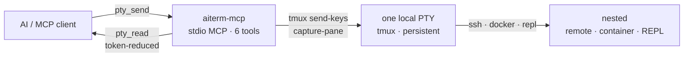

<p align="center">
  
</p>

# aiterm-mcp

[](https://github.com/kitepon-rgb/aiterm-mcp/actions/workflows/ci.yml)
[](https://www.npmjs.com/package/aiterm-mcp)
[](https://nodejs.org)
[](LICENSE)
[](https://www.npmjs.com/package/aiterm-mcp)
[](https://packagephobia.com/result?p=aiterm-mcp)

> *(日本語: [README.ja.md](README.ja.md))*

> Give an AI a **persistent local terminal** as a stdio MCP server. It holds **one** local PTY; SSH and containers are demoted to "a command you send into that terminal." Reads are token-reduced.

Just six tools — `pty_open` / `pty_send` / `pty_read` / `pty_key` / `pty_close` / `pty_list`. The backend is **tmux**, so sessions survive even if the MCP server or the AI client restarts.

## Quickstart (≈60 seconds)

One command registers it in Claude Code — no clone, no build, `npx` fetches it each run:

```bash
claude mcp add --scope user --transport stdio aiterm -- npx -y aiterm-mcp
```

Restart Claude Code, then verify the connection:

```bash
/mcp        # aiterm should show as connected, exposing 6 tools
```

Your first session — four calls, one persistent terminal:

```text
pty_open()                          → { session_id: "t1", attach: "tmux -S … attach -t t1" }
pty_send("t1", "echo hello")        → command sent into the PTY
pty_read("t1", { wait: true })      → "hello"   (token-reduced, completion detected)
pty_close("t1")                     → terminal released
```

That's it. The terminal in `t1` is real and persistent — `ssh`, `docker exec`, a REPL are just text you `pty_send` into it (see [Why](#why)). Prefer no install? Any MCP client can launch `npx -y aiterm-mcp` over stdio directly.

## Install

It's on npm — no clone, no build:

```bash
# Claude Code — recommended (no install; npx fetches it each run)
claude mcp add --scope user --transport stdio aiterm -- npx -y aiterm-mcp

# or install globally, then register the command name
npm i -g aiterm-mcp
claude mcp add --scope user --transport stdio aiterm -- aiterm-mcp
```

Needs **Node ≥ 18** and **tmux** (on native Windows: WSL with tmux inside it — see [Requirements](#requirements)). Other MCP clients: just run `npx -y aiterm-mcp` over stdio. More detail in [Install / register](#install--register) below.

## Why

Sending an AI one command at a time and reading back the result means, over SSH, repeating connect → authenticate → disconnect every round — slow, and it burns tokens. aiterm **holds one PTY persistently** and you type `ssh host` or `docker exec -it x bash` *inside it* (nesting). Session kind is never a tool-level distinction.

```
pty_open()                         → grab one local terminal
pty_send(id, "ssh 192.168.1.2")    → enter SSH inside that terminal
pty_send(id, "uname -a")           → run it on the remote
pty_read(id, { wait: true })       → read the reduced output
```

## Demo

<!-- demo gif: drop docs/demo.gif here (asciinema cast or animated GIF of the flow below) -->

The killer flow: open one PTY, nest into SSH *inside it*, run a command on the remote, and read back output that's already been token-reduced — no reconnect per command.

```text
# 1 — grab one local terminal (lives in tmux; survives restarts)
→ pty_open()
← { session_id: "t1", attach: "tmux -S /…/claude.sock attach -t t1" }

# 2 — nest SSH *inside* that same terminal (not a separate tool)
→ pty_send("t1", "ssh 192.168.1.2")
← sent
→ pty_read("t1", { until: "\\$ $" })          # remote prompt = "shell is back"
← user@remote:~$

# 3 — run a command on the remote, over the SAME PTY (no reconnect)
→ pty_send("t1", "uname -a")
→ pty_read("t1", { until: "\\$ $" })
← Linux remote 6.1.0 #1 SMP x86_64 GNU/Linux

# 4 — a noisy command, read with the per-command reducer
→ pty_send("t1", "git status")
→ pty_read("t1", { until: "\\$ $", rtk: true }) # self-contained, no rtk binary needed
← ## main…origin/main [ahead 1]
   M src/core.ts
   ?? notes.txt
   [reduced: control chars stripped · repeats collapsed · git-status reducer]
```

Notes that make this accurate, not a demo lie:

- Step 2/3 use **`until`** with the remote prompt because **while nested, quiescence cannot fire by design** — see [Completion detection](#completion-detection-4-layers) and [Known constraints](#known-constraints-by-design-not-bugs). `{ wait: true }` alone works at the local shell; nested needs `until` (or `mark: true`).
- The bracketed `[reduced: …]` line is illustrative of the meta/restore hint `pty_read` appends; the exact text comes from your output. The reducer is the **self-contained** `pty_read({ rtk: true })` path — no external `rtk` binary required.
- A human can `attach` to the `t1` socket and watch the same SSH session live (see [A human can watch](#a-human-can-watch)).

## How it works



One PTY is the only primitive. Everything else — SSH, containers, REPLs — is just text you `pty_send` into it. Because the PTY lives in tmux, sessions outlive the MCP server and the AI client.

## vs. the alternatives

| | **aiterm-mcp** | one-shot shell tool (per command) | generic terminal / tmux MCPs |
| --- | --- | --- | --- |
| Persistent session | ✅ tmux, survives restarts | ❌ new shell every call | ⚠️ varies |
| SSH / containers | nest with one `pty_send` | reconnect every command | ⚠️ often separate tools |
| Token-reduced reads | ✅ per-command reducers | ❌ raw output | ⚠️ rarely |
| Completion detection | 4-layer: exit / `until` / quiescence / timeout | n/a (blocks per call) | ⚠️ prompt-match, fragile |
| Human can co-drive | ✅ shared tmux socket (`attach`) | ❌ | ⚠️ varies |

## Requirements

- **Node.js >= 18**
- **tmux** (runtime prerequisite; check with `tmux -V`. Install with `apt install tmux` / `brew install tmux`)
  - **macOS / Linux / WSL2** run tmux directly. On macOS install it with `brew install tmux` (stock macOS ships none). If your MCP client is launched from the **GUI** rather than a terminal, Homebrew's bin (`/opt/homebrew/bin` on Apple Silicon, `/usr/local/bin` on Intel) may be off its `PATH`; aiterm auto-searches those locations, or set **`AITERM_TMUX=/path/to/tmux`** to point at it explicitly.
  - **Native Windows** has no tmux, so aiterm transparently runs tmux **inside WSL**. It needs [WSL](https://learn.microsoft.com/windows/wsl/) installed and initialized, with **tmux installed inside your WSL distro** (`sudo apt install tmux`); verify with `wsl tmux -V`. Sessions, the socket, and human `attach` all live on the WSL side — the AI just drives them from the Windows-side command. (You reach Windows tools the same way you reach SSH: `pty_send "powershell.exe …"` nests into PowerShell.)
- Optional: the [`rtk`](https://github.com/rtk-ai/rtk) binary (used by `pty_send`'s `rtk: true` delegation; works fine without it)

## Install / register

Register with Claude Code (CLI) at user scope (available in every project):

```bash
# Recommended — no install, npx fetches it each run
claude mcp add --scope user --transport stdio aiterm -- npx -y aiterm-mcp

# Or install globally and use the command name
npm i -g aiterm-mcp
claude mcp add --scope user --transport stdio aiterm -- aiterm-mcp
```

This registers it in `~/.claude.json`. Restart Claude Code; you'll get an approval prompt the first time. Check the connection with `/mcp`.

Any other MCP client works too — just launch `npx -y aiterm-mcp` (or `aiterm-mcp`) over stdio.

## Tools

| Tool | Role | Key args |
| --- | --- | --- |
| `pty_open` | Grab one terminal, return a `session_id` | `name?`, `shell="bash"` |
| `pty_send` | Send text (a command) | `session_id`, `text`, `enter=true`, `mark`, `force`, `rtk`, `raw` |
| `pty_read` | Read output, token-reduced (incremental by default) | `session_id`, `wait`, `until`, `timeout`, `screen`, `full`, `lines`, `line_range`, `raw`, `rtk` |
| `pty_key` | Send a control key | `session_id`, `key` (`C-c`/`Enter`/`Up`…) |
| `pty_close` | Close a session | `session_id` |
| `pty_list` | List sessions | (none) |

### Completion detection (4 layers)

`pty_read({ wait: true })` decides "is the command done?" via four layers: process exit / `until` regex match / output is quiescent ∧ the shell is back (quiescence) / timeout. While nested (inside SSH), the "shell is back" check cannot fire, so pass `until` with the remote prompt for a clean decision.

### Token reduction

- `pty_read` by default strips control characters, collapses repeated lines, and folds long output into head+tail (with a restore hint and a meta line).
- `pty_read({ rtk: true })` further shrinks the observed output with a per-command reducer (`git status`/`git log`/`grep`/`pytest` and more) — a self-contained reimplementation that needs no `rtk` binary.
- `pty_send({ rtk: true })` rewrites a known command into `rtk` form before sending, so reduction happens at the source if `rtk` exists there (passthrough otherwise).

### Safety

Before sending, `pty_send` blocks destructive commands (`rm -rf /`, `mkfs`, `dd of=/dev/…`, `DROP TABLE`, …) — pass `force: true` to override — and sanitizes ESC / bracketed-paste terminators. `pty_read` neutralizes control characters in what it returns.

## Known constraints (by design, not bugs)

- **While nested (ssh / docker / REPL), quiescence cannot fire by design**, because the foreground command is no longer in the shell set (bash/sh/zsh/fish/dash). Use `until` (a regex for the prompt etc.) or `mark: true` (an exit-code sentinel) for completion.
- **`is_complete=False` is not a failure.** It means "completion was not observed within `timeout`." For long commands, raise `timeout` or use `until`/`mark`.
- **The destructive gate is a tripwire, not a sandbox.** It blocks common destructive forms only. It does **not** catch relative-path `rm`, things that become dangerous after `$VAR` expansion, or commands run on the far side of an SSH session.
- **`pty_send({ rtk: true })` is single-line only and needs the external `rtk` binary** (passthrough without it). The `pty_read({ rtk: true })` reducer, by contrast, is self-contained and rtk-independent.
- **The `pytest` reducer matches rtk 0.42.0** on test counts, the rule line, and `FAILURES`-block formatting (locked by regression tests). It **deliberately preserves the full failure reason** on the `FAILED` summary lines (emitted under `-ra`/`-rf`), whereas rtk 0.42.0 truncates the reason at the first `" - "` — a readability choice, so those lines are intentionally not byte-identical to rtk. The `[full output: …]` tee-pointer line rtk appends on large output is not reproduced on the read side.
- **tmux is started with `-f /dev/null`**, so it does not read `~/.tmux.conf` (to keep behavior reproducible across machines).
- **All sessions live on a single socket (`claude.sock`).** `tmux … kill-server` removes them all.

## A human can watch

Sessions live on a shared tmux socket. The `tmux -S … attach -t <id>` line printed by `pty_open` lets a human attach to the same terminal and intervene (`Ctrl-b d` to detach). On native Windows the printed line is the WSL form — `wsl tmux -S … attach -t <id>` — since the session lives inside WSL.

## Development

```bash
npm install
npm run build      # tsc → dist/
npm test           # build, then the node:test regression suite (requires tmux)
npm link           # put `aiterm-mcp` on PATH locally
```

Logic lives in `src/core.ts` (tmux control, reduction, completion detection, safety) and `src/rtk.ts` (per-command reducers); `src/index.ts` is the MCP surface. The design origin and the reducer's porting source (the pytest reducer is ported to be byte-exact with upstream rtk 0.42.0, locked by regression tests) are in `prototype/python/`.

## Try it

One command, no clone, no build:

```bash
claude mcp add --scope user --transport stdio aiterm -- npx -y aiterm-mcp
```

If aiterm saved you a round-trip of tokens, **[star the repo](https://github.com/kitepon-rgb/aiterm-mcp)** — it's the cheapest way to help others find it.

- **npm:** https://www.npmjs.com/package/aiterm-mcp
- **Issues / bug reports:** https://github.com/kitepon-rgb/aiterm-mcp/issues

## License

MIT
