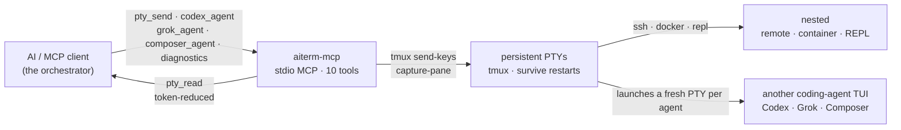

<p align="center">
  
</p>

# aiterm-mcp

[](https://github.com/kitepon-rgb/aiterm-mcp/actions/workflows/ci.yml)
[](https://www.npmjs.com/package/aiterm-mcp)
[](https://nodejs.org)
[](LICENSE)
[](https://packagephobia.com/result?p=aiterm-mcp)

> *(日本語: [README.ja.md](README.ja.md))*

> **Let your AI orchestrate other AIs.** From Claude Code — or any MCP client — one call spawns a coding agent (Codex, Grok, or Composer) inside a persistent terminal and hands you a session to drive: read what it's doing token-reduced, send it the next instruction.
>
> **What it is:** one persistent MCP terminal your AI drives — and can launch other coding agents into. `ssh`, `docker exec`, a REPL, or another agent's TUI all nest inside that one terminal as just text you send in. The mechanism is deliberately plain — your MCP client drives the other agent's terminal turn by turn: no hidden protocol, no shared memory, no autonomous negotiation.
>
> **No human at a tmux required.** aiterm is driven programmatically over MCP, so an AI can launch and drive another agent with no one sitting in the terminal — from an orchestration loop, a CI step, or a cron job.
>
> *MCP = Model Context Protocol — the open standard that lets tools like Claude Code plug capabilities into an AI.*

**Measured, not claimed:** on this repo's own 203-test suite, a `pty_read` puts **~7.1× fewer tokens** in your context than the raw log — and the pass/fail verdict survives the fold. → [When to reach for it vs. the built-in shell](#when-to-reach-for-it-vs-the-built-in-shell)

Ten tools: six **PTY tools** — `pty_open` / `pty_send` / `pty_read` / `pty_key` / `pty_close` / `pty_list` — to open, drive, and read one persistent terminal, three **agent launchers** — `codex_agent` / `grok_agent` / `composer_agent` — that each start another coding agent's TUI inside a fresh one, and `diagnostics` for safe factory readiness. The backend is **tmux**, so sessions survive even if the MCP server or the AI client restarts.

**Status:** actively maintained · the newcomer here, betting on a different shape (see [vs. the alternatives](#vs-the-alternatives)) · runs on Linux · WSL2 · macOS · native Windows for the core PTY tools (`agent_done` is POSIX/WSL/macOS only for now) · MIT · see the [CHANGELOG](CHANGELOG.md).

## Why now

A lot of 2026's agent tooling is converging on orchestration: a lead model delegating a mechanical refactor to Codex, running Composer on a bulk edit while it reviews the diff, fanning one task across several agents to spare its own context window. All of those agents already live in a terminal. aiterm makes that terminal a first-class, MCP-native tool — so the model doing the orchestrating can **spawn and steer the others without a human wiring up panes.**

## Two ways to use it

### 1. Drive SSH, containers, and REPLs in one persistent terminal — the primitive

This is the base, and it works with just tmux — no other CLI. `pty_open` grabs one local terminal; `ssh host`, `docker exec -it x bash`, or a REPL are just text you `pty_send` into it — **once**. Every command after that rides the same already-authenticated session. Session kind is never a tool-level distinction.

```
pty_open()                         → grab one local terminal
pty_send(id, "ssh 192.168.1.2")    → authenticate once, inside that terminal
pty_send(id, "uname -a")           → every later command rides the SAME session
pty_read(id, { wait: true })       → read the token-reduced output, completion detected
```

<sub>**Origin.** I built aiterm for exactly this. Driving my homelab from Claude Code one command at a time meant every SSH command became its own `connect → authenticate → disconnect`: re-typing the passphrase and one-time code each time, short-lived sessions piling up, and eventually my own defenses (`fail2ban`, `MaxStartups`/`MaxSessions`, account lockout) locking me out — the security meant to stop attackers ended up stopping me. Holding one authenticated session fixes all three at once. That pain is why the persistent terminal exists; launching whole other agents inside it is what it grew into.</sub>

### 2. Launch other coding agents into that terminal — the orchestration flagship

The same primitive hosts another agent's TUI. Three launchers each start one vendor's interactive coding-agent TUI inside a fresh persistent terminal and return a `session_id`. From there you drive it with the same `pty_read` / `pty_send` you'd use on any shell: read its output token-reduced, send it the next step. (The TUIs are full-screen apps, so `pty_read({ screen: true })` gives you the rendered view.) Agent launchers can also opt into hook-backed turn completion with `agent_done: true`, letting `pty_send({ wait: "agent_done" })` return after the agent turn ends. `codex_agent` can additionally wait for its initial `prompt`: pass `prompt`, `agent_done: true`, and `wait: "agent_done"`; aiterm starts the TUI first, waits until its input area is ready, submits the prompt, then returns after that first turn's Stop hook. Codex/Grok/Composer all have passing live smokes for follow-up `pty_send(wait:"agent_done")` when their vendor CLI is authenticated; Codex initial-prompt wait is also live-smoked. Grok/Composer initial-prompt wait is intentionally not exposed until the post-OAuth smoke passes. This needs the vendor's own CLI installed and authenticated — see [Requirements](#requirements).

```text
codex_agent({ session_name: "codex1", cwd: "/repo", agent_done: true,
              wait: "agent_done", prompt: "port test/legacy.py to vitest" })
                                    → { session_id: "codex1", … }   # Codex now live in a persistent terminal
pty_read("codex1", { screen: true })   → read what it's doing (token-reduced)
pty_send("codex1", "also fix the imports it broke", { wait: "agent_done" })
                                    → steer it, then return once Codex reaches its next turn boundary
```

One call per model, so the tool name itself tells you which model you get:

| Tool | Launches | Key args |
| --- | --- | --- |
| `codex_agent` | Codex CLI (OpenAI; terminal config/CLI default unless overridden) | `prompt?`, `model?`, `reasoning_effort?` (`low`/`medium`/`high`/`xhigh`/`max`/`ultra`; ultra enables proactive automatic delegation), `cwd?`, `session_name?`, `agent_done?`, `wait?`, `timeout?`, `screen?`, `lines?` |
| `grok_agent` | Grok Build, model `grok-4.5` by default (`model?` overrides) (xAI) | `prompt?`, `model?`, `reasoning_effort?` unsupported (an explicit value is an error; Grok CLI `--effort` is headless-only), `cwd?`, `session_name?`, `agent_done?` |
| `composer_agent` | Grok Build, model `grok-composer-2.5-fast` by default (`model?` overrides) (xAI) | `prompt?`, `model?`, `reasoning_effort?` unsupported (an explicit value is an error), `cwd?`, `session_name?`, `agent_done?` |

The vendor CLI must be installed and authenticated (`codex` for `codex_agent`; `grok` for both Grok tools). aiterm resolves the binary via `CODEX_BIN` / `GROK_BIN`, then `~/.local/bin/codex` / `~/.grok/bin/grok`, then `PATH`. Prerequisites are checked **before** a session exists: empty `model` values and any `reasoning_effort` for `grok_agent` / `composer_agent` are rejected up front; a missing CLI binary or a nonexistent `cwd` fails for all three. A rejected launch leaves **zero leftover session** behind, and if the launch keystroke itself can't be delivered aiterm tears the session down. (Without an initial prompt wait, aiterm does *not* then verify the vendor CLI actually started or authenticated — read the session to confirm the agent came up.) `codex_agent` forwards `model` as `-m` and `reasoning_effort` as `-c model_reasoning_effort=…` without validating the effort value, since Codex's accepted values vary by version. Grok/Composer reject `reasoning_effort`: Grok CLI `--effort` is only for headless `grok -p`, and the interactive TUI ignores it with a warning. Pass an absolute path for `cwd` — `~` is not expanded. Codex launch responses always report the effective model/effort and where each came from (argument, terminal-config inheritance, or CLI default), with an explicit warning when the effective effort is `ultra` (max reasoning plus proactive automatic delegation). `agent_done` uses launch-local managed vendor homes and does not edit your normal hook files; Codex links only `auth.json` and copies `config.toml` into its managed `CODEX_HOME` — explicitly passed `model` / `reasoning_effort` values also rewrite the matching top-level pins in that copy, so terminal pins don't silently leak into the child — while Grok/Composer additionally isolate `GROK_HOME` and `HOME` to suppress compat hook/plugin contamination. Grok OAuth uses the normal Grok home's `auth.json` and `auth.json.lock` as a pair so refresh locking does not split across sessions. Before the first unbound `pty_send({ wait: "agent_done" })`, aiterm waits for the vendor TUI's input prompt and fails before sending if the prompt is not ready, avoiding dropped startup input. `codex_agent` launcher `wait:"agent_done"` has the same requirement and is only valid with both `prompt` and `agent_done:true`; if the TUI is not ready, the prompt is not sent and the session is left inspectable with `initial_prompt=not_sent`. While an initial prompt is still `pending`/`sent`, ordinary `pty_send` is rejected to prevent mixed input; manual takeover can still use `pty_key`, or `pty_send(..., force:true)` if you intentionally want to type into that live TUI. `agent_done` currently requires POSIX filesystem semantics (`getuid`, secure temp files, hard-link checks), so it is supported on Linux, WSL2, and macOS; native Windows can still use the core PTY tools and agent launchers without `agent_done`.

There is deliberately **no Claude launcher**, and no protocol between the agents: aiterm's job is to let your Claude (or any MCP client) reach for *other* agents and drive their terminals. Because a launched agent is just another persistent session, everything else in this README applies to it: token-reduced reads, completion detection, and a human `attach` to watch or take over.

## Demo

<p align="center">
  
</p>

Real captured output — each block below was just run through aiterm in this repo; the numbers, the elision marker, and every `is_complete` verdict are the tool's own, not mocked. The bracketed meta line is what `pty_read` appends; its labels are Japanese in the actual output, translated here for readability (the [Japanese README](README.ja.md) shows them verbatim).

A long output folded head+tail — the middle is elided by the reducer, not by me (166 → 56 tokens):

```text
→ pty_send("demo", "seq 1 150")
→ pty_read("demo", { wait: true })
← 1
  2
  3
  ⋮  (head runs to line 29 — abbreviated in this README)
  … ⟨102 lines elided · full=true, or line_range="A:B"⟩ …    ← the tool's own marker
  ⋮  (tail resumes at line 132 — abbreviated in this README)
  149
  150
  [aiterm demo: 51 lines / ~56 tok (raw 152 lines / ~166 tok); 102 lines hidden] [is_complete=True via quiescent]
```

A `grep`, folded by the per-command reducer to a count header plus just the hits:

```text
→ pty_send("demo", "grep -rn capture-pane src/ test/")
→ pty_read("demo", { wait: true, rtk: true })
← 2 matches in 1 files:

  src/core.ts:159:// maxBuffer defaults to 1 MiB; capture-pane (large scrollback) … (line truncated here)
  src/core.ts:335:const args = ["capture-pane", "-p", "-J", "-t", name];
  [aiterm demo: rtk:grep applied / ~46 tok (raw ~53 tok)] [is_complete=True via quiescent]
```

Nesting is just text you send in — here a Python REPL *inside* the same PTY (an `ssh host`, a `docker exec -it … bash`, or a launched coding-agent TUI nests exactly the same way):

```text
→ pty_send("demo", "python3")
→ pty_read("demo", { until: ">>>" })                # nested prompt = "the inner shell is ready"
→ pty_send("demo", "print(sum(range(1_000_000)))")
→ pty_read("demo", { wait: true, until: ">>>" })
← 499999500000                                      [is_complete=True via until]
```

The only edits to the captures above are the two `⋮` lines (a long head/tail run abbreviated for the README) and one over-long grep line truncated to fit — the `⟨…⟩` marker, the token counts, and every `is_complete` verdict are exactly what the tool printed. (Use `until: ">>>"` without a trailing space — the captured prompt is trimmed, so `">>> "` would miss and fall through to `timeout`.) While nested, pass `until` (the inner prompt) or `mark: true`, because quiescence cannot fire there by design — see [Completion detection](#completion-detection-5-layers) and [Known constraints](#known-constraints-by-design-not-bugs). A human can `attach` to the same tmux socket and watch any of this live (see [A human can watch](#a-human-can-watch)).

## Quickstart (≈60 seconds)

One command registers it in Claude Code — no clone, no build, `npx` fetches it each run:

```bash
claude mcp add --scope user --transport stdio aiterm -- npx -y aiterm-mcp
```

Restart Claude Code, then verify the connection:

```bash
/mcp        # aiterm should show as connected, exposing 10 tools
```

Your first session — four calls, one persistent terminal:

```text
pty_open()                          → { session_id: "t1", attach: "tmux -S … attach -t t1" }
pty_send("t1", "echo hello")        → command sent into the PTY
pty_read("t1", { wait: true })      → "hello"   (token-reduced, completion detected)
pty_close("t1")                     → terminal released
```

That's it. The terminal in `t1` is real and persistent — `ssh`, `docker exec`, a REPL, or a launched agent's TUI are just things that live inside it. To launch a worker agent instead, one call does it: `codex_agent()` returns a `session_id` you drive with the same `pty_read` / `pty_send`.

**Prefer a global install, or a different client?**

```bash
# install globally, then register the command name
npm i -g aiterm-mcp
claude mcp add --scope user --transport stdio aiterm -- aiterm-mcp
```

This registers it in `~/.claude.json`; you'll get an approval prompt the first time. **Any other MCP client** (Cursor, Cline, Claude Desktop, …) should work too — just launch `npx -y aiterm-mcp` (or `aiterm-mcp`) over stdio. Needs **Node ≥ 18** and **tmux** — see [Requirements](#requirements).

## Headless: no human at the terminal

Because an MCP client drives aiterm programmatically over stdio, everything above can run with **nobody sitting at a tmux**. Your Claude Code session can `codex_agent()` a task, `pty_read` the result, and act on it — unattended. That makes aiterm a fit for exactly the places a human-driven terminal isn't:

- **Multi-agent orchestration** — an orchestrator hands sub-tasks to Codex / Grok / Composer, each in its own persistent session, and reads them all back.
- **CI** — a job step can spin up an agent, drive it, and tear it down.
- **cron** — a scheduled run can launch an agent and collect its output.

The terminal is real and shared, so a human *can* jump in ([A human can watch](#a-human-can-watch)) — but nothing requires one to.

## How it works



One PTY is the only primitive. Everything else — SSH, containers, REPLs, and the launched agent TUIs — is just something interactive running inside a persistent terminal, driven with the same `pty_send` / `pty_read`. Each launcher opens its own fresh PTY. Because the PTYs live in tmux, sessions outlive the MCP server and the AI client.

## When to reach for it vs. the built-in shell

Your MCP client already has a shell tool, and it wins on some jobs. aiterm wins on others. We measured both on the same commands in this repo, counting tokens the same way on each side (characters ÷ 4, aiterm's own estimator), so the comparison is apples-to-apples.

Start with the built-in tool for a light one-shot. `git log --oneline -5` is one round-trip; aiterm is two — `pty_send` then `pty_read` — and that second round-trip costs more than a light command saves (~7 s vs ~13 s).

The second round-trip pays for itself once the output runs long, or the state has to outlive the call.

| Command | Built-in shell | aiterm | Verdict |
| --- | --- | --- | --- |
| `git log --oneline -5` | 1 call, ~7 s | 2 calls, ~13 s | **shell** (fewer round-trips) |
| `npm test` (203 tests) | ~4,292 tok | ~607 tok | **aiterm** (~7.1× fewer, verdict kept) |
| `find node_modules -type f` | ~500 tok¹ | ~456 tok | tokens tie; aiterm keeps head and tail + `line_range` |
| `grep -rn "session" src/` | ~2,989 tok | ~1,096 tok | **aiterm** (~2.7×; long lines get clipped²) |

On the repo's own 203-test suite the reduction is real and safe. The built-in tool drops the whole 223-line log — ~4,292 tokens — into context. aiterm folds its own capture of the run down to ~607:

```text
[aiterm demo: 51 行 / ~607 tok (raw 223 行 / ~4292 tok); 172 行 hidden] [is_complete=True via mark]
```

<sub>`行` = lines; the meta line is quoted verbatim from aiterm's real output.</sub>

That is about **7.1× fewer** tokens reaching the model, and the verdict survives the fold: the tail still carries `ℹ tests 203 / ℹ pass 203 / ℹ fail 0`. The reduction drops the noise and keeps the line you opened the log for. Wall-clock effectively ties, so on a run this long the extra round-trip is a small part of the total.

aiterm also holds state across calls. The built-in tool runs each call in a fresh shell, so cwd resets between calls and the environment doesn't carry. Send `cd /tmp && export BENCH_VAR=hello123`, then read it back in a second, separate call:

```text
built-in shell  →  var=                   # empty; env dropped, cwd back at project root
aiterm          →  cwd=/tmp var=hello123  # one tmux session holds both
```

`cd` then set env then build, `ssh` once then run ten commands on the authenticated session, drive a live REPL or a launched agent's TUI turn by turn — one tmux session holds all of it. Reach for aiterm when the terminal has to remember something.

<sub>¹ Today's harness auto-offloads the ~192 KB dump to a file and previews only a ~2 KB head, so the token counts nearly tie; aiterm reports the accurate line count and lets `line_range="A:B"` pull any slice later, head or tail. ² The `rtk` grep reducer truncates long lines (~80 chars) and folds the overflow into `[+N more]`, which suits scanning; use the built-in tool when you need every full line.</sub>

## vs. the alternatives

aiterm sits at the intersection of two families: terminal-driving MCP servers, and the newer "agents talk to each other through a shared terminal" idea (see [Where aiterm fits](#where-aiterm-fits)). Here's how the axes line up — honestly, including where the others are strong.

|  | **aiterm-mcp** | one-shot shell MCP<br/>(e.g. `mcp-server-commands`) | terminal / SSH / tmux MCPs<br/>(e.g. `iterm-mcp`, `ssh-mcp`, `tmux-mcp`) | shared-tmux agent-to-agent<br/>(e.g. `smux`) |
| --- | --- | --- | --- | --- |
| Persistent session | ✅ tmux, survives restarts | ❌ new shell every call | ⚠️ varies | ✅ tmux |
| SSH / containers / REPLs | nest with one `pty_send` | reconnect every command | ⚠️ often separate tools | ✅ tmux (human drives) |
| Launch another agent in one call | ✅ `codex_agent` / `grok_agent` / `composer_agent` | ❌ | ❌ | ⚠️ agents join a human-run tmux via a CLI + skills |
| Headless (no human at a tmux) | ✅ MCP-driven, programmatic | ✅ | ⚠️ varies | ❌ built around a human in the tmux |
| MCP-native (any MCP client) | ✅ one `claude mcp add` | ✅ | ✅ (they are MCPs) | ❌ tmux config + CLI + Agent Skills |
| Token-reduced reads | ✅ per-command reducers | ❌ raw output | ⚠️ rarely | ❌ raw tmux |
| Completion detection | 5-layer: exit / `mark` / `until` / quiescence / timeout | n/a (blocks per call) | ⚠️ prompt-match, fragile | ❌ agent reads the pane |
| Destructive-command gate | ✅ tripwire (override with `force`) | ❌ | ⚠️ varies | ❌ |
| Human can co-drive | ✅ shared tmux socket (`attach`) | ❌ | ⚠️ varies | ✅ (its core model) |

## Where aiterm fits

"AIs talking to each other through a shared terminal" is becoming its own category — and it's a genuinely good idea. The terminal is a universal interface every coding agent already speaks, so no bespoke agent-to-agent protocol is needed; the shell *is* the shared surface. `smux` (by @shawn_pana) popularized this framing as a one-command shared tmux environment a human sets up, that agents then join via a `tmux-bridge` CLI and Agent Skills. It's good at the in-the-loop, shared-pane workflow it's built for, and it has real traction.

aiterm takes the same core insight — the terminal as the meeting point — and makes three deliberate, different choices:

1. **Headless by construction.** Because aiterm is driven programmatically over MCP, an AI can launch and drive another agent with *no human sitting in the tmux* — from an orchestration loop, a CI step, or a cron job. The shared-tmux tools lead with a human at the keyboard (their docs center on interactive pane navigation), so unattended operation isn't their native mode; aiterm's is.
2. **MCP-native, not a workflow you adopt.** aiterm is a stdio MCP server: one `claude mcp add` line and it works as structured tools in any MCP client that speaks stdio (tested in Claude Code; Cursor, Cline, and Claude Desktop speak the same protocol and should work the same way). It doesn't ask you to adopt a tmux config, learn pane navigation, or install skills into your setup — the client already knows how to call tools.
3. **Launching an agent is one tool call — an orchestration primitive.** `codex_agent()` spawns Codex in a persistent terminal and returns a session you drive immediately. You don't arrange panes or paste between them by hand; the launch, the steering, and the reads are all tool calls the orchestrating model can make on its own.

On top of that sits a productized layer a raw tmux bridge doesn't have: **token-reduced reads**, **5-layer completion detection**, and a **destructive-command tripwire**. None of this makes the human-in-the-tmux model wrong — it's a different, complementary bet on where the human is standing.

## Tools

| Tool | Role | Key args |
| --- | --- | --- |
| `pty_open` | Grab one terminal, return a `session_id` | `name?`, `shell="bash"` |
| `pty_send` | Send text (a command) | `session_id`, `text`, `enter=true`, `wait`, `timeout`, `screen`, `lines`, `mark`, `force`, `rtk`, `raw` |
| `pty_read` | Read output, token-reduced (incremental by default) | `session_id`, `wait`, `until`, `until_regex`, `timeout`, `screen`, `full`, `lines`, `line_range`, `raw`, `rtk`, `agent_transcript` |
| `pty_key` | Send a control key | `session_id`, `key` (`C-c`/`Enter`/`Up`…) |
| `pty_close` | Close a session | `session_id` |
| `pty_list` | List sessions (agent rows carry `agent=<kind>` metadata) | (none) |
| `diagnostics` | Read-only factory readiness as machine-readable JSON | (none) |

`diagnostics` never starts a PTY or agent. It reports package version, MCP call readiness, a read-only PTY-list summary, and optional vendor-launcher availability. It deliberately excludes paths, environment values, credentials, command text, PTY output, and raw logs; normal unset optional dependencies are `not_applicable`, while an indeterminate probe is `unverified`.

### Interactive agent launchers

Each launcher starts a specific vendor's interactive coding-agent TUI inside a fresh persistent PTY and returns its `session_id` — from there you drive it with plain `pty_read` / `pty_send`, exactly like any other session. One tool per model, so the tool name itself tells you which model you get. The TUI is a full-screen app, so read it with `pty_read({ screen: true })` for the rendered view.

| Tool | Launches | Key args |
| --- | --- | --- |
| `codex_agent` | Codex CLI (OpenAI; terminal config/CLI default unless overridden) | `prompt?`, `model?`, `reasoning_effort?` (`low`/`medium`/`high`/`xhigh`/`max`/`ultra`; ultra enables proactive automatic delegation), `cwd?`, `session_name?`, `agent_done?`, `wait?`, `timeout?`, `screen?`, `lines?` |
| `grok_agent` | Grok Build, model `grok-4.5` by default (`model?` overrides) (xAI) | `prompt?`, `model?`, `reasoning_effort?` unsupported (an explicit value is an error; Grok CLI `--effort` is headless-only), `cwd?`, `session_name?`, `agent_done?` |
| `composer_agent` | Grok Build, model `grok-composer-2.5-fast` by default (`model?` overrides) (xAI) | `prompt?`, `model?`, `reasoning_effort?` unsupported (an explicit value is an error), `cwd?`, `session_name?`, `agent_done?` |

The vendor CLI must be installed and authenticated (`codex` for `codex_agent`; `grok` for both Grok tools). aiterm resolves the binary via `CODEX_BIN` / `GROK_BIN`, then `~/.local/bin/codex` / `~/.grok/bin/grok`, then `PATH`. Prerequisites are validated before a session is created: empty `model` and any Grok/Composer `reasoning_effort` are errors, while a missing CLI or nonexistent `cwd` fails for all three; a failed launch leaves no session behind. Codex forwards `model` as `-m` and `reasoning_effort` as `-c model_reasoning_effort=…`; Grok/Composer reject effort because interactive TUI does not support it (Grok CLI `--effort` is headless-only). Full details under [Launch other coding agents into that terminal](#2-launch-other-coding-agents-into-that-terminal--the-orchestration-flagship). Pass an absolute path for `cwd` — `~` is not expanded. `agent_done` is hook-backed for agent launchers; Codex/Grok/Composer have passing live smokes on Linux/WSL2/macOS for follow-up `pty_send(wait:"agent_done")`, and Codex has a live smoke for launcher `prompt + wait:"agent_done"`. Native Windows can launch agents but `agent_done` is not supported yet. Codex managed `CODEX_HOME` links only `auth.json`, copies `config.toml`, and owns its own `hooks.json`. Before the first unbound agent send, `pty_send({ wait:"agent_done" })` waits for the vendor TUI input prompt and fails before sending if it is not ready. `codex_agent` launcher `wait:"agent_done"` requires `prompt` plus `agent_done:true`; it sends the initial prompt only after the TUI is ready, and returns `initial_prompt=not_sent` without sending if the TUI is blocked before input. In Grok OAuth mode, aiterm keeps hook/config isolation per launch but shares both `auth.json` and `auth.json.lock` with the normal Grok home; missing OAuth auth fails without leaving a session behind.

When an agent's answer is longer than the `wait:"agent_done"` screen tail (pane height ≈ 24 lines), recover it in full with `pty_read({ agent_transcript: true })`. It returns the most recently completed turn's final assistant message in plain text, read from the vendor's structured session transcript under the managed home — no re-prompting. Codex joins on the Stop hook `turn_id`; Grok/Composer take the assistant rows after the last real user row. Read-only, and mutually exclusive with `screen`/`full`/`rtk`/`line_range`/`wait` (`lines` is allowed). A missing transcript, a non-agent session, or an unextractable message is an explicit error, never a silent empty.

### Completion detection (5 layers)

`pty_read({ wait: true })` decides "is the command done?" via five layers: process exit / a `mark:true` sentinel (auto-detected — see below) / an `until` match (a literal substring by default; pass `until_regex: true` for a regex) / output is quiescent ∧ the shell is back (quiescence) / timeout. While nested (inside SSH, a container, a REPL, or a launched agent's TUI), the "shell is back" check cannot fire, so pass `until` with the inner prompt — or send with `mark: true` and `pty_read({ wait: true })` auto-detects the completion sentinel (no `until` needed, works nested too) — or, for a full-screen agent TUI, read `{ screen: true }` once its output settles. Sessions launched with `agent_done:true` can instead use `pty_send({ wait:"agent_done" })`, which first waits for the agent TUI input prompt when needed, then waits for the vendor Stop hook and returns the screen after the turn boundary; `codex_agent` launcher `wait:"agent_done"` does the same for the initial `prompt`. Pre-send readiness failures are MCP errors for `pty_send`, while launch-time initial prompt readiness failures return the session with `initial_prompt=not_sent`; timeouts after sending are reported as `is_complete=False via agent_timeout`, not as success. Normal `pty_read` on an agent session can append auxiliary metadata such as `agent_event_seen=true completion_attribution=none`, but a stale hook event is not promoted to `is_complete=True`. If a complete hook JSONL line is malformed, the timeout suffix includes `malformed_events=N` for diagnosis. If the turn is done but the terminal screen/log does not settle within the flush window, aiterm appends `agent_done_but_screen_unstable`.

### Token reduction

- `pty_read` by default strips control characters, collapses repeated lines, and folds long output into head+tail (with a restore hint and a meta line).
- `pty_read({ rtk: true })` further shrinks the observed output with a per-command reducer (`git status`/`git log`/`grep`/`pytest` and more) — a self-contained reimplementation that needs no `rtk` binary.
- `pty_send({ rtk: true })` rewrites a known command into `rtk` form before sending, so reduction happens at the source if `rtk` exists there (passthrough otherwise).

### Safety

Before sending, `pty_send` blocks destructive commands (`rm -rf /`, `mkfs`, `dd of=/dev/…`, `DROP TABLE`, …) — pass `force: true` to override — and sanitizes ESC / bracketed-paste terminators. `pty_read` neutralizes control characters in what it returns by default (`raw: true` returns the bytes verbatim). This is a **tripwire, not a sandbox** (see [Known constraints](#known-constraints-by-design-not-bugs)).

## A human can watch

Sessions live on a shared tmux socket. The `tmux -S … attach -t <id>` line printed by `pty_open` (and by each agent launcher) lets a human attach to the same terminal and intervene (`Ctrl-b d` to detach) — including watching a launched Codex/Grok/Composer session run and taking the keyboard from your AI mid-task. On native Windows the printed line is the WSL form — `wsl tmux -S … attach -t <id>` — since the session lives inside WSL.

## Requirements

- **Node.js >= 18**
- **tmux** (runtime prerequisite; check with `tmux -V`. Install with `apt install tmux` / `brew install tmux`)
  - **macOS / Linux / WSL2** run tmux directly. On macOS install it with `brew install tmux` (stock macOS ships none). If your MCP client is launched from the **GUI** rather than a terminal, Homebrew's bin (`/opt/homebrew/bin` on Apple Silicon, `/usr/local/bin` on Intel) may be off its `PATH`; aiterm auto-searches those locations, or set **`AITERM_TMUX=/path/to/tmux`** to point at it explicitly.
  - **Native Windows** has no tmux, so aiterm transparently runs tmux **inside WSL**. It needs [WSL](https://learn.microsoft.com/windows/wsl/) installed and initialized, with **tmux installed inside your WSL distro** (`sudo apt install tmux`); verify with `wsl tmux -V`. Sessions, the socket, and human `attach` all live on the WSL side — the AI just drives them from the Windows-side command. (You reach Windows tools the same way you reach SSH: `pty_send "powershell.exe …"` nests into PowerShell.)
- For the **agent launchers**: the corresponding vendor CLI, installed and authenticated — `codex` for `codex_agent`, `grok` for `grok_agent` / `composer_agent`. (Not needed if you only use the PTY tools.)
- Optional: the [`rtk`](https://github.com/rtk-ai/rtk) binary (used by `pty_send`'s `rtk: true` delegation; works fine without it)

## Known constraints (by design, not bugs)

- **While nested (ssh / docker / REPL / a launched agent TUI), quiescence cannot fire by design**, because the foreground command is no longer in the shell set (bash/sh/zsh/fish/dash). When nested with no `until` and no `mark`, `pty_read({ wait: true })` returns early as `is_complete=False via nested` (rather than burning the full `timeout`, since no signal can confirm completion there) with a note to pass `until` (a literal substring by default; `until_regex: true` for a regex) or `mark: true` (an exit-code sentinel, auto-detected) for a confirmed completion. For a full-screen agent TUI, read `{ screen: true }` once its output settles.
- **`is_complete=False` is not a failure.** It means "completion was not observed within `timeout`." For long commands, raise `timeout` or use `until`/`mark`.
- **The destructive gate is a tripwire, not a sandbox.** It blocks common destructive forms only. It does **not** catch relative-path `rm`, things that become dangerous after `$VAR` expansion, or commands run on the far side of an SSH session — and it does not police what a launched coding agent does inside its own session.
- **The agent launchers spawn a vendor TUI; they don't wrap or proxy it.** aiterm validates prerequisites and starts the CLI in a persistent PTY — the model, auth, and behavior are the vendor CLI's. There is no `claude` launcher and no protocol between agents; "conversation" is your MCP client driving the TUI (send input, read output).
- **`pty_send({ rtk: true })` is single-line only and needs the external `rtk` binary** (passthrough without it). The `pty_read({ rtk: true })` reducer, by contrast, is self-contained and rtk-independent.
- **The `pytest` reducer matches rtk 0.42.0** on test counts, the rule line, and `FAILURES`-block formatting (locked by regression tests). It **deliberately preserves the full failure reason** on the `FAILED` summary lines (emitted under `-ra`/`-rf`), whereas rtk 0.42.0 truncates the reason at the first `" - "` — a readability choice, so those lines are intentionally not byte-identical to rtk. The `[full output: …]` tee-pointer line rtk appends on large output is not reproduced on the read side.
- **tmux is started with `-f /dev/null`**, so it does not read `~/.tmux.conf` (to keep behavior reproducible across machines).
- **All sessions live on a single socket (`claude.sock` on POSIX).** `tmux … kill-server` removes them all.

## Development

```bash
npm install
npm run build      # tsc → dist/
npm test           # build, then the node:test regression suite (requires tmux)
npm link           # put `aiterm-mcp` on PATH locally
```

Logic lives in `src/core.ts` (tmux control, reduction, completion detection, safety, agent launch) and `src/rtk.ts` (per-command reducers); `src/index.ts` is the MCP surface. The design origin and the reducer's porting source (the pytest reducer is ported to match upstream rtk 0.42.0, except the deliberate `FAILED`-line difference noted above, and is locked by regression tests) are in `prototype/python/`.

## Try it

One command, no clone, no build:

```bash
claude mcp add --scope user --transport stdio aiterm -- npx -y aiterm-mcp
```

If aiterm let your AI hand a task to another agent — or saved you a round-trip of tokens — **[star the repo](https://github.com/kitepon-rgb/aiterm-mcp)**. It's the cheapest way to help others find it.

- **npm:** https://www.npmjs.com/package/aiterm-mcp
- **Issues / bug reports:** https://github.com/kitepon-rgb/aiterm-mcp/issues

## License

MIT
